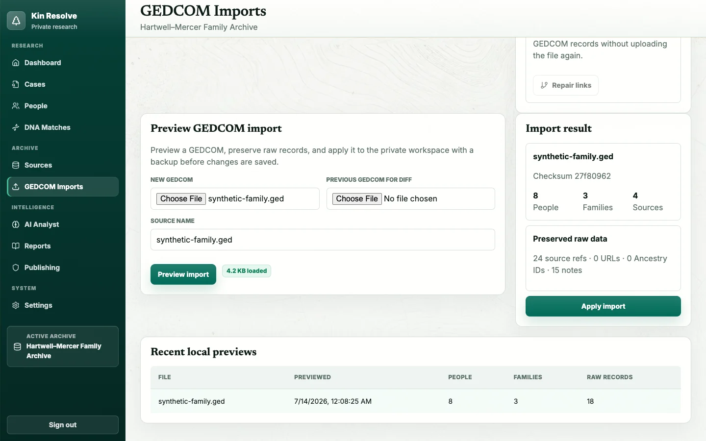

<div align="center">

# 🌲 KinSleuth

**Self-hosted genealogy research workspace — a private investigation lab paired with a curated public family archive.**

[](LICENSE)
[](https://nextjs.org)
[](https://react.dev)
[](https://github.com/pgvector/pgvector)
[](https://vitest.dev)

*Import GEDCOM files, triage DNA matches, build research cases, run AI-assisted analysis — then publish only the ancestors you choose, with living-person privacy enforced by default.*


</div>

---

## Why KinSleuth?

Most genealogy tools make you choose between *sharing everything* and *sharing nothing*. KinSleuth splits the difference with two faces on one database:

| 🔒 Private workspace (`/app`) | 🌍 Public archive (`/`) |
| --- | --- |
| Every imported person, source, DNA match, and research note | Only profiles you explicitly curate and publish |
| Password-gated pages and APIs | Living, private, and sensitive records withheld automatically |
| Research cases, task queues, AI analysis runs | Published people, stories, places, and selected citations |

The repository ships with **synthetic fixtures only**. Real GEDCOM exports, DNA match files, and uploads belong in ignored local storage (`data/`, `uploads/`).

## Feature tour

### Public family archive

A curated, privacy-gated site for the ancestors you choose to share — published profiles pass both a manual publish flag *and* automated living/privacy gates before anonymous visitors ever see them.


### Investigation dashboard

Workspace metrics, cases in motion, an action queue of privacy and quality problems, and top DNA signals — all computed from your actual archive.

### People workspace

Server-paginated search over every imported person with publication, privacy, and life-status filters plus per-person curation controls.


### GEDCOM imports with reviewable diffs

Every GEDCOM is previewed before it is applied: new, changed, and removed records are diffed against the current workspace so curated research is never silently overwritten. Raw records, xrefs, custom tags, and checksums are preserved, and each apply stores a restorable pre-import snapshot.



Large files (over 3.5 MB) upload directly from the browser to private Blob storage, bypassing serverless request limits — files up to 25 MB each are supported on Vercel.

### DNA match triage

Import DNA match CSVs, rank matches by a helpfulness score (shared cM, tree status, surnames, places, shared matches), edit match details, link matches to cases as evidence, and generate connection hypotheses with candidate common ancestors.


### AI Analyst

Deterministic structural checks (date conflicts, privacy risks) run with no API key at all. Add an OpenAI-compatible provider key and the analyst answers research questions with cited workspace context, saved run history, and staged case-task suggestions you approve before they land.


### Publishing readiness & quality reports

Per-profile readiness scoring, publication blockers, source-coverage gaps, and low-confidence facts — reviewed before anything goes public.


## Quick start

```bash
git clone https://github.com/erichare/kinsleuth.git
cd kinsleuth
npm install
cp .env.example .env
docker compose up -d postgres
npm run dev
```

Open [http://localhost:3000](http://localhost:3000). The first read seeds a synthetic demo archive so every screen has data.

> `DATABASE_URL` is required (the `.env.example` default matches the bundled Postgres service). Private `/app` routes are open in local development; set `KINSLEUTH_APP_PASSWORD` plus a long `AUTH_SECRET` to protect them.

### Full stack via Docker Compose

```bash
cp .env.example .env
docker compose up --build
```

Compose provisions Postgres with pgvector and MinIO-compatible object storage alongside the app.

## Route map

| Route | Purpose |
| --- | --- |
| `/` | Public archive landing page |
| `/people`, `/people/[slug]` | Published people and profiles |
| `/stories`, `/places` | Public stories and place index |
| `/app` | Investigation dashboard |
| `/app/people` | Search, filter, and curate people |
| `/app/cases` | Research cases, evidence, hypotheses, and task queues |
| `/app/dna` | DNA match triage and connection hypotheses |
| `/app/sources` | Source register and transcript review |
| `/app/imports` | GEDCOM preview and apply flow |
| `/app/ai` | AI Analyst with saved run history |
| `/app/reports` | Quality and evidence reports |
| `/app/publishing` | Public-profile readiness review |
| `/app/settings` | Archive branding, provider, storage, and role reference |
| `/api/health` | JSON runtime health (`200` healthy / `503` degraded) |

## Configuration

`.env.example` documents every supported variable:

| Variable | Notes |
| --- | --- |
| `DATABASE_URL` | **Required.** Postgres connection string for workspace storage |
| `DATABASE_POOL_MAX` | Max connections per instance; use `2` for serverless |
| `DATABASE_AUTO_MIGRATE` | Runs the idempotent bootstrap schema; set `false` once production is provisioned |
| `AUTH_SECRET` | Signs the private-workspace session cookie |
| `KINSLEUTH_APP_PASSWORD` | Enables password protection for `/app` and private APIs |
| `KINSLEUTH_ARCHIVE_ID` | Archive id; defaults to `archive-default` |
| `BLOB_READ_WRITE_TOKEN` | Private Vercel Blob store for staging large GEDCOM uploads |
| `CRON_SECRET` | Bearer token for the daily stale-upload cleanup job |
| `AI_BASE_URL` / `AI_API_KEY` | OpenAI-compatible provider; deterministic fallback runs without a key |
| `AI_API_MODE` | `responses` (default) or `chat` |
| `AI_CHAT_MODEL` / `AI_EMBEDDING_MODEL` | Chat model for analysis; the embedding model is reserved for planned pgvector retrieval (not implemented yet) |
| `APP_BASE_URL` | Base URL of the running app |
| `S3_*` | Reserved for object-storage-backed source uploads |

Archive name and tagline are edited in **Settings → Archive branding** and flow through both the private workspace and the public site. Settings also reports live database, storage, and AI-provider health.


## Development

```bash
npm run typecheck     # TypeScript
npm run lint          # ESLint
npm run test          # Vitest unit tests
npm run test:db       # Postgres integration tests (needs TEST_DATABASE_URL)
npm run test:db:large # 10.5+ MB / 65k-person GEDCOM load regression
npm run build         # Production build
```

Set `TEST_DATABASE_URL` to a **disposable** Postgres database before running the DB suites — never point it at real data. Stable-release CI runs both database suites against an ephemeral pgvector service before deploying.

## Data & privacy model

```
GEDCOM / DNA CSV ──▶ Private workspace (Postgres) ──▶ Curation gates ──▶ Public archive
                        │                                  │
                        ├─ raw records, xrefs, checksums   ├─ manual publish flag
                        ├─ pre-import snapshots            ├─ living-person gate
                        └─ cases, evidence, AI runs        └─ privacy level gate
```

- Anonymous visitors see only manually published, automatically re-checked public content.
- Imported people default to private; publication requires deceased status and public privacy.
- Pre-import backups store a full workspace snapshot (the ten most recent are retained).
- Before publishing real data, review `/app/publishing` and `/app/reports`, then spot-check the public pages.

| Path | Contents | Git status |
| --- | --- | --- |
| `fixtures/` | Synthetic sample GEDCOM used by tests and demos | committed |
| `uploads/sources/` | Uploaded source files | ignored |
| `data/` | Local GEDCOM, DNA CSV, and research exports | ignored |

## Production releases

Deployments are release-driven: publishing a stable GitHub Release runs `.github/workflows/vercel-release.yml`, which validates the tag, builds with the production environment, and deploys the prebuilt artifact to Vercel (Git auto-deployments are disabled in `vercel.json`).

Required GitHub Actions secrets: `VERCEL_TOKEN`, `VERCEL_ORG_ID`, `VERCEL_PROJECT_ID`.

Required Vercel production environment: `DATABASE_URL` (Supabase transaction pooler on port `6543` with `sslmode=require` — KinSleuth upgrades known Supabase pooler connections to `verify-full` with the bundled root CA), `DATABASE_POOL_MAX=2`, `DATABASE_AUTO_MIGRATE=false`, `AUTH_SECRET`, `KINSLEUTH_APP_PASSWORD`, `BLOB_READ_WRITE_TOKEN`, and `CRON_SECRET`.

## Project map

| Path | What lives there |
| --- | --- |
| `app/` | Next.js App Router pages and API routes |
| `components/` | Shared UI and workspace components |
| `lib/` | GEDCOM parsing, workspace store, search, DNA, AI, privacy, publishing, reports |
| `db/migrations/` | Postgres + pgvector schema (idempotent bootstrap and upgrades) |
| `tests/` | Vitest unit and Postgres integration coverage |
| `docs/` | Architecture notes and README screenshots |

## Status & known limitations

KinSleuth is a working vertical slice suited to local/self-hosted beta use — not yet a production genealogy platform.

- General source-file uploads still target local disk; wire object storage before production use of file attachments.
- ANSEL-encoded GEDCOM files are decoded on a best-effort basis (UTF-8, UTF-16, and Windows-1252 are handled properly).
- Importing two *unrelated* GEDCOM files can collide on xref-derived record ids; curation flags are protected from cross-person leaks, but the second import replaces colliding records. Re-imports of the same tree merge as intended.
- There is no GEDCOM export yet — imports are one-way until the exporter ships.
- Semantic (pgvector) retrieval is planned but not implemented; the embeddings table is provisioned and unused.
- Background jobs, per-user accounts, and enforced role management are still evolving.

## License

KinSleuth is free software licensed under the [GNU Affero General Public License v3.0](LICENSE) (AGPL-3.0-only). You may self-host, modify, and redistribute it under the AGPL's terms; if you run a modified version as a network service, the AGPL requires you to offer its source to users of that service. See [CONTRIBUTING.md](CONTRIBUTING.md) for contribution terms.
