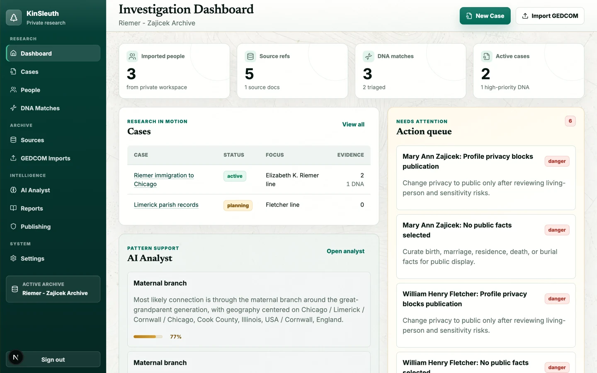
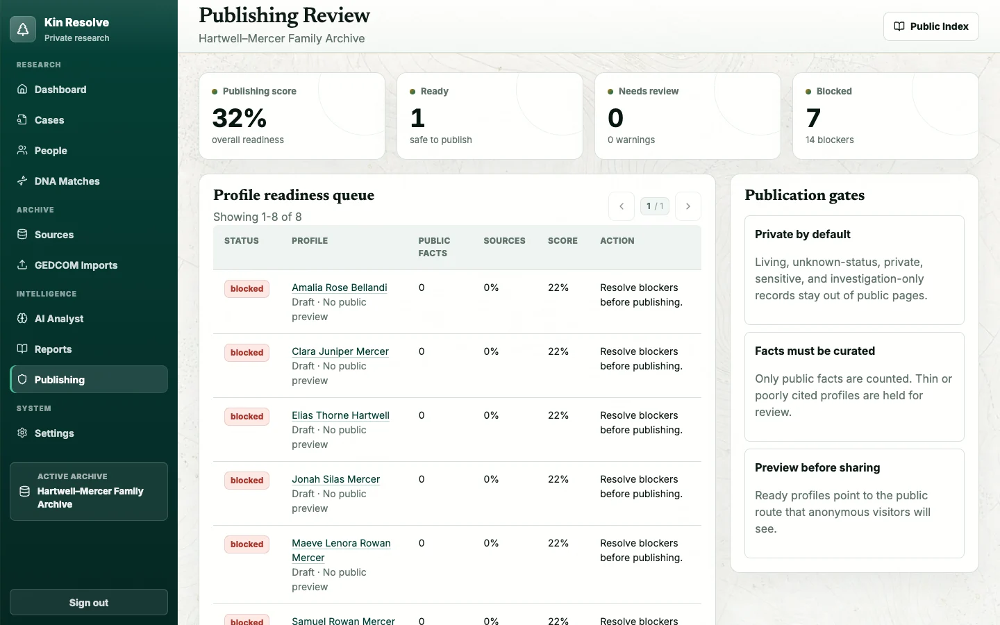

<div align="center">

# 🌲 Kin Resolve

**Self-hosted genealogy research workspace — a private investigation lab paired with a curated public family archive.**

[](LICENSE)
[](https://nextjs.org)
[](https://react.dev)
[](https://github.com/pgvector/pgvector)
[](https://vitest.dev)

*Import and refresh tree exports from Ancestry, Family Tree Maker, RootsMagic, or any GEDCOM-producing app; triage DNA matches; build research cases; and publish selected deceased profiles through privacy gates.*

<p><em>Every person, record, place, photograph, story, and DNA value shown below belongs to the wholly fictional Hartwell–Mercer demo.</em></p>



</div>

---

## Why Kin Resolve?

Most genealogy tools make you choose between *sharing everything* and *sharing nothing*. Kin Resolve splits the difference with two faces on one database:

| 🔒 Private workspace (`/app`) | 🌍 Public archive (`/`) |
| --- | --- |
| Every imported person, source, DNA match, and research note | Only profiles you explicitly curate and publish |
| Account-gated pages and APIs (owner-created accounts) | Living, private, and sensitive records withheld automatically |
| Research cases, task queues, AI analysis runs | Published deceased profiles and facts already marked public |

The repository ships with the wholly fictional **Hartwell–Mercer Family Archive**. Every included name, date, place, record, photograph, story, and DNA value was invented for Kin Resolve; no detail represents a real person or family. Real GEDCOM exports, DNA match files, and uploads belong in ignored local storage (`data/`, `uploads/`).

## Hosted private beta — proposed, not live

The hosted private beta at `app.kinresolve.com` is a gated proposal, not a currently available service. Owner and counsel approval remains pending, and real family data must not be accepted until the launch gates in the [hosted beta contract](docs/hosted-beta-contract.md) pass.

The proposed first cohort is intentionally narrow:

- Plain GEDCOM imports only: up to 10 MiB (10,485,760 bytes) and 40,000 people.
- Sources are transcript-only: metadata, links, and pasted text/transcripts are allowed; binary source and evidence uploads are disabled.
- Deterministic local analysis makes no external provider call; external-provider AI is disabled.
- DNA is disabled.
- The public archive is disabled.
- Real-data public publishing is disabled.
- ZIP and package media are disabled.

These hosted limits do not narrow the features available to local/self-hosted operators. Hosted deployment requires the exact seven-flag manifest documented in [docs/configuration.md](docs/configuration.md) and in the beta contract.

## Feature tour

### Public family archive

A curated, privacy-gated site for the ancestors you choose to share — published profiles pass both a manual publish flag *and* automated living/privacy gates before anonymous visitors see them. Current controls are person-level; granular fact/source curation and persisted stories are still in progress.


### Immersive synthetic research challenge

Open thirty period-inspired record images across five immersive investigations, compare accessible transcripts, save cited observations to a clue notebook, and state conclusions without erasing unresolved conflicts. The cases span identity, provenance, photograph dating, same-name reconstruction, and DNA clustering, and run entirely in the browser with fictional data.


### Investigation dashboard

Workspace metrics, cases in motion, an action queue of privacy and quality problems, and top DNA signals — all computed from your actual archive.

### People workspace

Server-paginated search over every imported person with publication, privacy, and life-status filters plus per-person curation controls.


### Remembered data sources with reviewable refreshes

The **Data sources** workspace remembers each Ancestry, Family Tree Maker, RootsMagic, or generic GEDCOM export origin, models every later export against the last applied snapshot and your current local research, and groups the diff into additions, edits, conflicts, and deletions for review; apply and rollback are transactional, idempotent, and archive-scoped. It is an export workflow, not an account connection — Kin Resolve never asks for provider credentials or writes changes back. Your data is never locked in: the whole archive exports back to GEDCOM 5.5.1 from the Data sources page (or `GET /api/exports/gedcom`), with curation flags carried as compatibility-preserved custom `_KS_` tags, while refreshes treat incoming publication controls as untrusted and always create new people private and unpublished. See [Data source integrations](docs/data-source-integrations.md) for the full provider, rights, malware-scanning, and storage contract.

### DNA match triage

Import DNA match CSVs, rank matches by a helpfulness score (shared cM, tree status, surnames, places, shared matches), edit match details, link matches to cases as evidence, and generate connection hypotheses with candidate common ancestors.


### AI Analyst

Deterministic structural checks (date conflicts, privacy risks) run with no API key at all. Add an OpenAI-compatible provider key and the analyst answers research questions with cited workspace context, saved run history, and staged case-task suggestions you approve before they land.


### Publishing readiness & quality reports

Per-profile readiness scoring, publication blockers, source-coverage gaps, and low-confidence facts — reviewed before anything goes public.



Every public and private route is listed in the [route map](docs/route-map.md).

## Quick start

```bash
git clone https://github.com/erichare/kinresolve.git
cd kinresolve
npm install
cp .env.example .env
docker compose up -d postgres
npm run archive:provision -- --mode demo
npm run dev
```

Open [http://localhost:3000](http://localhost:3000). The provisioning command creates the versioned, wholly fictional demo exactly once; rerunning it verifies the same persisted mode without resetting later work.

> `DATABASE_URL` is required (the `.env.example` default matches the bundled Postgres service). Private `/app` routes are open in local development; set a long `AUTH_SECRET` and create the owner account at `/setup` to protect them.

### Full stack via Docker Compose

```bash
cp .env.example .env
# Set MINIO_ROOT_USER and MINIO_ROOT_PASSWORD in .env before continuing.
docker compose up --build
```

Set unique non-empty `MINIO_ROOT_USER` and `MINIO_ROOT_PASSWORD` values in `.env` first —
Compose fails closed when either is missing. The stack provisions Postgres with pgvector
and the fictional demo, then starts the app, the worker, and loopback-only private MinIO
object storage. Ports, CORS, and storage details are in [docs/configuration.md](docs/configuration.md#docker-compose-stack).

## Configuration

The essentials:

| Variable | Notes |
| --- | --- |
| `DATABASE_URL` | **Required.** Postgres connection string for workspace storage |
| `AUTH_SECRET` | Secret for account sessions (better-auth); required in production |
| `APP_BASE_URL` | Exact canonical origin of the running app; production requires one HTTPS origin |
| `KINSLEUTH_ARCHIVE_ID` | Archive id; set explicitly before `npm run archive:provision` |
| `MINIO_ROOT_USER` / `MINIO_ROOT_PASSWORD` | **Required for Docker Compose.** Operator-supplied credentials shared by the bundled MinIO service, app, worker, and bucket initializer |
| `AI_BASE_URL` / `AI_API_KEY` | OpenAI-compatible provider; deterministic fallback runs without a key |
| `KINSLEUTH_ALLOW_SIGNUPS` | Hosted releases require exactly `false`; self-hosted first-run signup remains available when no account exists |

Every variable is documented in [`.env.example`](.env.example); the full reference table, the hosted seven-flag manifest, and the cookie-origin/browser-mutation rules live in [docs/configuration.md](docs/configuration.md).

Archive name and tagline are edited in **Settings → Archive branding** and flow through both the private workspace and the public site. Settings also reports live database, storage, and AI-provider health.


## Development

```bash
npm run typecheck     # TypeScript
npm run lint          # ESLint
npm run test          # Vitest unit tests
npm run test:db       # Every Postgres-gated suite, serialized (needs TEST_DATABASE_URL)
npm run test:db:large # 10.5+ MB / 65k-person GEDCOM load regression
npm run test:release-upgrade # Rehearse v0.17.4 -> current (needs a local control DB)
npm run test:release-compatibility # Prove archived v0.17.4 is unsafe on current schema (local scratch DBs only)
npm run migrations:verify   # Verify migration checksums and released history
npm run demo:verify # Block retired real-family demo identifiers and images
npm run db:migrate    # Apply pending db/migrations to DATABASE_URL (Node 22.6+)
npm run db:migrate:production # Migrate through MIGRATION_DATABASE_URL only
npm run db:migrations:verify-production # Prove the exact production ledger
npm run db:identity    # Fingerprint DATABASE_IDENTITY_URL from read-only catalogs
npm run storage:identity:provision # Write and fingerprint the private storage sentinel
npm run build         # Production build
```

Node versions are split for now: the product app targets Node 22 (pinned in
`.nvmrc`) while the marketing site in `site/` targets Node 24 (`site/.nvmrc`).
A root `engines` field is deliberately omitted until the runtimes converge:
Vercel builds read `engines.node` ahead of the project setting, so pinning it
is a deployment change, not a documentation change. Converging on a single
version is planned after launch.

Migration machinery, `TEST_DATABASE_URL` discipline, and the destructive upgrade/compatibility rehearsals are documented in [docs/development.md](docs/development.md).

## Data & privacy model

```
Provider export / DNA CSV ──▶ Private workspace (Postgres) ──▶ Curation gates ──▶ Public archive
                                  │                                  │
                                  ├─ raw records and snapshots       ├─ manual publish flag
                                  ├─ reviewable refresh changes      ├─ living-person gate
                                  └─ cases, evidence, AI runs        └─ privacy level gate
```

- Anonymous visitors see only manually published, automatically re-checked public content.
- Imported people default to private; publication requires deceased status and public privacy.
- Pre-import backups store a full workspace snapshot (the ten most recent are retained).
- Before publishing real data, review `/app/publishing` and `/app/reports`, then spot-check the public pages.

| Path | Contents | Git status |
| --- | --- | --- |
| `fixtures/` | Synthetic sample GEDCOM used by tests and demos | committed |
| `uploads/sources/` | Uploaded source files | ignored |
| `data/` | Local GEDCOM, DNA CSV, and research exports | ignored |

## Releases & operations

Releases are candidate-first: an operator runs the manual release workflow, which rehearses an unaliased candidate before anything is promoted, and automatic containment/safety workflows restore the pinned holding deployment or pause the project when a run fails. The legacy staging demo controller is retired; the always-on synthetic public demo runs in its own dedicated project, release workflow, and safety cell. Full procedures:

- [docs/releases.md](docs/releases.md) — staging/production release phases, protected environments, and required Vercel settings
- [docs/public-demo-runbook.md](docs/public-demo-runbook.md) — public demo release, rollback, containment, and monitoring
- [docs/static-holding-deployment.md](docs/static-holding-deployment.md) — the zero-runtime rollback target
- [docs/production-backup-and-restore.md](docs/production-backup-and-restore.md), [docs/incident-response.md](docs/incident-response.md), and [docs/operations-monitoring.md](docs/operations-monitoring.md) — recovery and operations

## Project map

| Path | What lives there |
| --- | --- |
| `app/` | Next.js App Router pages and API routes |
| `components/` | Shared UI and workspace components |
| `lib/` | GEDCOM/package parsing, integrations, private object storage, durable jobs, workspace store, search, DNA, AI, privacy, publishing, reports |
| `db/migrations/` | Versioned Postgres + pgvector schema migrations, tracked in `schema_migrations` |
| `tests/` | Vitest unit and Postgres integration coverage |
| `docs/` | Architecture notes and README screenshots |

## Status & known limitations

Kin Resolve is a working vertical slice suited to local/self-hosted beta use — not yet a production genealogy platform.

- Data-source artifacts have an archive-namespaced private-storage contract; legacy general source-file attachments still target local disk and need the same backend before production use.
- ANSEL-encoded GEDCOM files are decoded on a best-effort basis (UTF-8, UTF-16, and Windows-1252 are handled properly).
- Remembered data sources scope provider identifiers and GEDCOM xrefs to a connection. The legacy direct `/api/imports` path still uses xref-derived record ids, so two unrelated files sent through that legacy route can collide.
- Ancestry support is export-only. Partner OAuth, incremental API pulls, AncestryDNA, hints, messages, and writeback remain disabled unless a future written partner agreement explicitly authorizes them.
- FTM/RootsMagic binary media retention is not implemented. Packages still receive path reconciliation and missing/ambiguous-file reports. All non-GEDCOM ZIP entries must scan clean even while desktop media retention is disabled; retention stays gated on the unfinished rights-attestation release.
- Semantic (pgvector) retrieval is planned but not implemented; the embeddings table is provisioned and unused.
- Durable Postgres jobs provide leases, retries, cancellation, idempotency, and redacted errors. The registered integration parser runs through `npm run worker` for self-hosting or `/api/cron/integration-jobs` for bounded hosted processing. Invitations and member management are still evolving.

## License

Kin Resolve is free software licensed under the [GNU Affero General Public License v3.0](LICENSE) (AGPL-3.0-only). You may self-host, modify, and redistribute it under the AGPL's terms; if you run a modified version as a network service, the AGPL requires you to offer its source to users of that service. See [CONTRIBUTING.md](CONTRIBUTING.md) for contribution terms.
