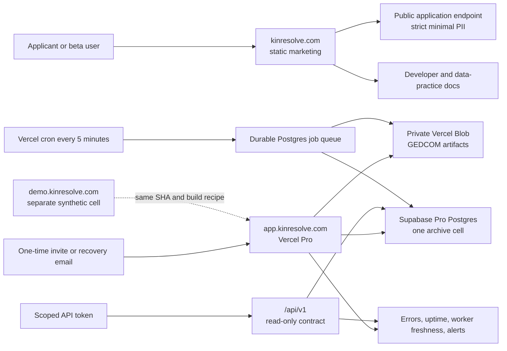
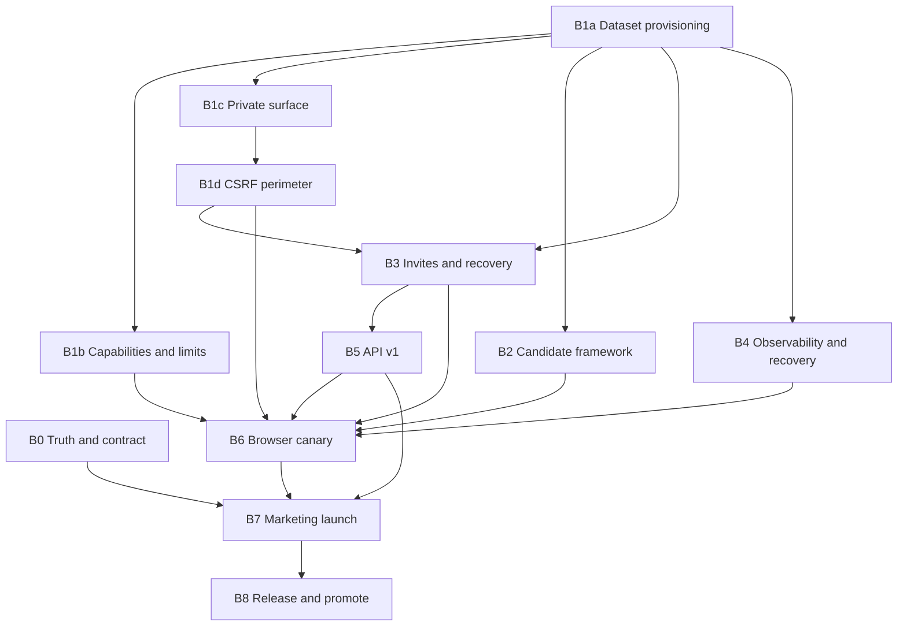

> Status: In execution · Last updated: 2026-07-15

# Kin Resolve hosted private beta launch blueprint

- **Status:** Execution in progress; source integration, safe holding surfaces, and the staging demo-session control plane are complete, while owner, legal, runtime, provider, and recovery gates remain open
- **Planning date:** 2026-07-14
- **Last execution update:** 2026-07-15
- **Planning base:** blueprint drafted at `be6aca1b7b1f449a988fd496b24be9fde16ce55d`; B0–B7 plus holding and release-safety hardening are merged on `main` through PR 48 at `5cff6fa4b31a7d365b78658103fdace647984288`
- **Primary product origin:** `https://app.kinresolve.com`
- **Marketing origin:** `https://kinresolve.com`
- **Recommended launch window:** 30–40 engineering days for one primary engineer, or roughly 4–5 elapsed weeks with two engineering streams plus an independent owner/legal track
- **Launch owner:** Eric

### Live execution snapshot — 2026-07-15

- B0–B7 source work is merged on `main` through PR 44. PRs 45–48 then hardened custom
  GitHub run-name containment, Vercel protection-redirect validation, exact canonical
  hostname-to-deployment proof, and the checked-in holding deployment path. The last
  integrated launch snapshot is `5cff6fa4b31a7d365b78658103fdace647984288`.
- `kinresolve.com`, `/developers`, and `/beta/thanks` serve the truthful applications-open
  prelaunch package from Vercel deployment `dpl_AHHAfGM5J7oDFR9AtaGpagZ6ykro`, produced by
  GitHub Actions run `29460468707`. The copy still says invitations have not started.
- `demo.kinresolve.com` points to the exact checked-in zero-runtime holding artifact at
  Vercel deployment `dpl_FK2eGhDVNRBXQmiYhHHWtnQX9TsQ`. Stage-only run `29463530811`
  passed the pre-promotion controls; promotion and canonical-hostname proof passed in run
  `29463602384`.
- `app.kinresolve.com` points to the same exact zero-runtime holding artifact at Vercel
  deployment `dpl_HHU4A9yHZSw7YFCWtNLVMxqtroqd`. Stage-only run `29464019356` passed the
  pre-promotion controls; promotion and canonical-hostname proof passed in run
  `29464086035`. The holding deployment IDs are recorded in the protected staging,
  production, containment, and recovery environments that consume them.
- **Not live:** neither product hostname serves the Kin Resolve runtime, authentication,
  invitations, or API; `/api/health` correctly returns `404` on both holding surfaces.
  The beta-live marketing claim has not been switched, API launch and native intake remain
  off, staging has no runtime environment contract, and legal approval has not been
  recorded.
- `main` is protected with strict Product CI and CodeQL requirements, PR-only changes,
  resolved conversations, and force-push/deletion blocks. Because Eric is currently the
  only repository collaborator, the rule requires zero outside approvals and retains the
  administrator recovery path.
- The repository now has a persistent synthetic staging lifecycle: a staging-only release
  records an immutable candidate without entering the product production job or environment;
  a separately acknowledged
  open operation accepts only that exact fresh successful attempt; explicit close returns
  the canonical hostname to the pinned holding deployment; and failed/cancelled/timed-out
  sessions trigger automatic holding restoration or a fail-closed project pause. The
  lifecycle has not been dispatched because the isolated runtime and approved legal bytes
  do not exist yet. It restores traffic to holding but deliberately does not claim to reset
  database or object-store state.
- The current critical path is owner D1–D8 sign-off; counsel-approved legal bytes and an
  approved applicant access/DSAR process; fresh isolated staging database and object
  storage; verified transactional email, support, and monitoring routes; protected runtime
  configuration; and an evidence-retaining staging-only release plus open/close dress
  rehearsal.
  Production additionally requires isolated pilot and recovery resources, observed
  restore/deletion/monitoring, exact candidate promotion, and coordinated claim publication.
- No real family data is authorized. The first public launch remains a synthetic,
  invitation-only beta until every applicable gate in section 8 has recorded evidence.

### Merged implementation detail

- B0 and B1a–B1d are merged through PRs 36–40: truthful beta scope, explicit dataset
  provisioning, server-enforced capability limits, the private hosted surface, and the
  same-origin mutation perimeter are on `main`.
- B2 merged through PR 41: candidate-first staging and production workflows, static
  zero-runtime holding deployments, durable write fencing, exact migration/identity proofs,
  attested database-plus-object recovery evidence, attempt-scoped cleanup leases, exact
  automatic-safety receipts, fail-closed Vercel auto-assignment repair, the archived
  `v0.17.4` incompatibility harness, and both large-data release gates are on `main`.
- B3 and B4 are merged through PRs 42–43: paused-by-default invitations, verified-email
  access, recovery/session revocation, exact legal-byte acceptance, durable abuse limits,
  transactional email, the audience-bound signed operator CLI, redacted monitoring,
  operator export/deletion, backup/restore evidence, and recovery operations are on `main`.
- B5–B7 merged through PR 44: scoped one-time-display API tokens, durable quotas, stable
  non-content UUIDs, archive-safe projections, OpenAPI 3.1, developer documentation,
  revocation and retention, the browser golden path and production-safe canaries, truthful
  prelaunch marketing and application intake, and disabled-by-default native application
  source are on `main`. Release mode keeps API v1 off by default and requires a fresh
  SHA-bound, attested Vercel WAF/configuration/probe packet for `api-launch`.
- The B7 source package also includes the fixed-field product endpoint, exact-origin and
  abuse controls, minimal-PII persistence, receipt/founder delivery, 90-day cleanup,
  signed count-only deletion, static dual-mode form, thank-you page, and synthetic launch
  media. Public copy says applications are open but invitations have not started and
  separates source controls from live behavior. Counsel-approved legal bytes, an approved
  identity-verified applicant access/DSAR delivery process, provider/mail-route proof,
  protected runtime activation, and the evidence-backed live claim switch remain
  external/launch-time gates.
- B8 remains protected runtime execution work. DNS, the exact safe holding deployments,
  staging-only candidate provenance, explicit synthetic-demo open/close, exact live legal
  endpoint probing, and automatic staging holding repair are present in source. Legal
  approval, full provider/runtime configuration, the first observed staging session,
  recovery/deletion/monitoring evidence, exact production candidate promotion, and
  coordinated claim publication have not been completed.

## 1. Outcome

Ship an invitation-only Kin Resolve private beta that is visually polished, operationally credible, and honest about its data boundary.

The launch is not complete when a Vercel URL returns `200`. It is complete when:

1. `app.kinresolve.com` serves the real product behind secure invitation and recovery flows.
2. One isolated pilot archive can safely complete the GEDCOM research journey.
3. A separate synthetic demo can be reset without touching pilot data.
4. A documented, read-only developer API works with scoped, revocable tokens.
5. `kinresolve.com` accurately markets what is live, captures applications, and links to product, API, privacy, status, and support material.
6. The team has observed candidate promotion, rollback, backup restore, deletion, monitoring, and incident procedures—not merely written them down.

The shortest credible route is a **concierge, single-archive design-partner beta**, not a shared multi-family SaaS launch. The code still resolves one deployment-selected archive and does not enforce tenant isolation with database policies. Each unrelated real family therefore gets an isolated deployment/database/storage cell until shared tenancy is deliberately built.

## 2. Executive launch decision

### Recommended topology

| Surface | Purpose | Data | Access |
| --- | --- | --- | --- |
| `kinresolve.com` | Marketing, product tour, application, launch note, data practices, developer docs | Public copy and synthetic media only | Public |
| `demo.kinresolve.com` | Resettable Hartwell–Mercer walkthrough and founder demos | Synthetic fixture only | Invite or founder-operated |
| `app.kinresolve.com` | Flagship 30-day design-partner pilot | One real archive after all real-data gates pass | One owner/household, invitation only |
| `app.kinresolve.com/api/v1/*` | Read-only developer API for the same archive | Private archive projections | Scoped personal access token |
| `status.kinresolve.com` | Availability and incident communication | No family data | Public |

Do not add `api.kinresolve.com` for beta. Keeping the API on the product origin avoids another cookie/CORS/DNS/security boundary. Do not advertise the existing browser `/api/*` routes as a public platform API; they are an internal, session-authenticated application contract.

### Recommended cohort-one contract

- Free, invitation-only, 30 days, no billing and no open signup.
- One genealogist or one trusted household in one isolated archive cell.
- Plain GEDCOM only, initially capped at **10 MB and 40,000 people**. The 50,000-person integration fixture is the proof target, not the admitted limit; lower the cap if hosted-worker rehearsal does not show at least 2× time/memory headroom.
- Enabled: GEDCOM upload, durable processing, review/apply/rollback, people and source search, cases, evidence, hypotheses, tasks, deterministic quality/privacy checks, publication-readiness review, full GEDCOM export, and read-only API access.
- Allowed content: source metadata and pasted text/transcripts.
- Disabled server-side: DNA import/triage, external-provider AI, real-data public publishing, binary source attachments, FTM/RootsMagic media retention, Ancestry partner API/OAuth/writeback, collaboration outside the one household, billing, and open signup.
- Founder-operated onboarding, one-business-day support target, weekly check-in, operator-assisted export/deletion, announced maintenance, and no uptime SLA.
- Begin with synthetic data. Admit real family data only after the legal, restore, deletion, recovery, and security gates in section 8 pass.

This is intentionally narrower than the source tree. A disabled feature must be rejected at the API boundary as well as hidden in the interface.

## 3. Historical planning-base truth and why launch work was required

The following was the 2026-07-14 planning snapshot. The live execution snapshot and
merged implementation detail above are the current source of truth for completed work.

- `kinresolve.com` is live and `www` redirects correctly.
- The beta intake is a prepared `mailto:` link; it does not create an application record or an account.
- `app.kinresolve.com` has no DNS record.
- `kinsleuth.vercel.app` is a static `noindex` holding page. Even `/api/health` returns that HTML placeholder, so HTTP status alone is a false-positive health check.
- The latest product release is `v0.17.4` from 2026-07-10. At planning base `be6aca1`, `main` is 194 commits and eleven migrations beyond that release anchor; B2 adds migration 013 on top of that base.
- Current `main` Product CI and CodeQL are green, and the GitHub security alert queues are clear.
- The marketing site says “Current private beta,” “working beta,” and “available now” in `site/app/page.tsx`, while its footer says “Private beta in development.” Until launch, that is contradictory.
- The product has strong foundations on `main`: database-backed auth and RBAC, a fail-closed API registry, private object storage, durable jobs, reviewable imports, rollback, and export.
- The release workflow is not production-safe for the migration-bearing current `main`. `README.md` explicitly says it does not migrate production or prove backup, candidate smoke, promotion, or database rollback.
- The first public visitor can currently claim `/setup`; email verification, reset, and invitations are not implemented.
- An empty archive currently seeds the Hartwell–Mercer fixture. A real pilot needs an explicit empty mode.
- Product security headers, production observability, a browser canary, complete deletion, and a restore drill are absent.
- Multi-tenant isolation, hosted genetic-data consent, legal terms, and guaranteed backups are expressly disclaimed on the current privacy page.

Relevant implementation anchors:

- Release warning: `README.md:222-246`
- Current limitations: `README.md:259-269`
- Release workflow: `.github/workflows/vercel-release.yml:1-171`
- Product deployment config and crons: `vercel.json:1-17`
- Single deployment-selected archive: `lib/workspace-store.ts:96-103`
- First-account signup boundary: `app/api/auth/[...all]/route.ts:18-29`
- Email verification/recovery gap: `lib/auth.ts:19-25`
- API access registry: `lib/api-access.ts:23-132`
- Hosted-beta disclosures: `site/app/privacy/page.tsx:56-68`
- Marketing contradiction: `site/app/page.tsx:140-142,203-215` and `site/components/site-footer.tsx:12`
- Data-source API contract: `docs/data-source-integrations.md:279-312`

## 4. What “incredibly impressive” means

Polish should concentrate on one complete, evidence-led journey instead of a wide collection of half-enabled features.

### The 12-minute launch story

1. Open `kinresolve.com` and frame the unresolved Hartwell–Mercer question.
2. Show the public fictional challenge and its evidence-first method.
3. Accept an invite and land in an intentionally empty or clearly labeled demo archive.
4. Upload a synthetic GEDCOM through private object storage.
5. Watch durable processing survive a reload.
6. Review additions, edits, conflicts, and deletions before applying them.
7. Roll the change back, then apply it again to prove control.
8. Search people and sources; open a research case; connect evidence; compare hypotheses; assign the next task.
9. Run deterministic date and privacy checks with a visible “no external AI used” disclosure.
10. Show publication blockers without publishing the real archive.
11. Create a read-only API token, run one documented `curl`, and revoke it.
12. Export GEDCOM and end on the portability/privacy promise.

### Launch-quality bar

- No placeholder, dead navigation, legacy KinSleuth branding, shared credentials, or implied unavailable feature in the golden path.
- Every dataset is visibly labeled `Synthetic demo` or `Private pilot`.
- Every destructive action has preview, explicit confirmation, success feedback, and a recovery route.
- Error screens show a request ID and a support link, never private record content.
- Anonymous and membership-less requests fail closed.
- The synthetic demo is resettable from an operator command and cannot reach pilot resources.
- The core authenticated/mutating browser journey passes against the exact SHA on an isolated staging custom origin before production deployment. The exact production candidate artifact then passes non-mutating production checks before promotion.
- Public media uses only synthetic people, records, and screenshots.

## 5. Beta API v1 developer preview

The updated launch promise includes an API. Build a deliberately small external contract rather than relabeling the browser's internal routes.

### Contract

- Base URL: `https://app.kinresolve.com/api/v1`
- Authentication: `Authorization: Bearer kr_beta_<random-secret>`
- Tokens: 256-bit random secret, display once, store only a cryptographic digest and short non-secret prefix.
- Ownership: only an archive owner can create or revoke a token.
- Scope: token is bound to one user, one archive, explicit scopes, expiry, and revocation state.
- Launch scopes: `archive:read`, `cases:read`, `sources:read`, `reports:read`, and separately privileged `archive:export`.
- Launch API is read-only. Do not expose import/apply/rollback, publication, DNA, AI, member, or settings mutation endpoints.
- Pagination: opaque cursor, default 25, maximum 100.
- Errors: stable JSON envelope with `code`, safe `message`, and `requestId`; never reveal whether an identifier exists in another archive.
- Rate limit: proposed 60 requests/minute and 10,000/day per token, enforced through concurrency-safe durable buckets; return standard `RateLimit-*` and `Retry-After` headers. A separate edge/firewall rule must rate-limit invalid-token traffic before it can amplify database work.
- Versioning: `/v1`; breaking changes require a new path. Mark the program “Developer Preview” in prose, not through an unstable URL.
- Documentation: OpenAPI 3.1 source committed to the repo, contract-tested, published at `/developers/`, with copy-paste examples and a changelog.
- Telemetry: request count, latency, status class, token ID, and route template only—never query text, person names, source text, or response bodies.

### Launch endpoint set

| Endpoint | Scope | Notes |
| --- | --- | --- |
| `GET /api/v1/meta` | `archive:read` | API version, product version, archive display metadata, capability flags |
| `GET /api/v1/people` | `archive:read` | Cursor page; bounded query; private archive projection |
| `GET /api/v1/people/{id}` | `archive:read` | Private 404 for unknown/out-of-archive ID |
| `GET /api/v1/sources` | `sources:read` | Cursor page; no blob keys or private download URLs |
| `GET /api/v1/cases` | `cases:read` | Cursor page; no unbounded nested evidence graph |
| `GET /api/v1/reports/quality` | `reports:read` | Deterministic report projection |
| `GET /api/v1/exports/gedcom` | `archive:export` | Owner-only scope; attachment, `no-store`, audited event |

### API data model

Add a versioned migration for:

- `api_tokens`: `id`, `archive_id`, `user_id`, `name`, `prefix`, fixed-length `digest`, validated `scopes`, `created_at`, `expires_at`, `last_used_at`, `revoked_at`; unique digest/prefix indexes; transactional membership ownership invariant; explicit cascade/restrict behavior.
- `api_rate_limit_buckets`: bounded bucket key, window, count, expiry; unique window key, concurrency-safe atomic update, expiry/cleanup index, and bounded cleanup job.
- `security_events`: actor/token, archive, event type, request ID, timestamp, non-sensitive metadata.

Token creation and revocation use the authenticated settings UI. Revocation must take effect on the next request. Token values must never appear in logs, analytics, support events, URL parameters, or subsequent database reads.

### API launch proof

- OpenAPI validates and every documented operation maps to a registered route/method.
- Every route has anonymous, invalid-token, expired-token, revoked-token, wrong-scope, wrong-archive, happy-path, pagination, rate-limit, and redaction tests.
- The isolated staging canary mints a short-lived token, reads known synthetic data,
  revokes it, and proves the next call is `401`. Production creates one ephemeral,
  least-privilege `archive:read` token through the protected migration connection,
  reads only `/meta` on the exact candidate and canonical origin, revokes it, and proves
  the next canonical call is `401`. The secret exists only in a mode-`0600` runner file;
  the retained token/security rows are non-content release evidence and consume one
  bounded lifetime-token inventory slot.
- Documentation contains a real command using `$KINRESOLVE_TOKEN`, never a literal launch token.

## 6. Marketing and launch package

### Immediate truth patch

Within one day, while engineering proceeds, change public wording from “current/working private beta” to:

> Private beta applications are open. Invitations have not started; hosted access begins only after the launch gates pass.

Do not switch to “Private beta is live” until the production launch checklist is signed.

### Go-live content

The marketing launch PR must ship as one coordinated claim set:

- Homepage: “A private workspace for resolving family-history questions with evidence.”
- Product tour: the 12-minute story condensed into six synthetic screenshots.
- Beta page: cohort boundary, supported GEDCOM size, exclusions, support expectation, pricing posture, and application form.
- Developers page: API value proposition, authentication, endpoint overview, OpenAPI link, examples, limits, changelog, and developer-preview terms.
- Data practices: current controls plus the exact retention, deletion, subprocessors, backup posture, and external-AI-disabled boundary.
- Security page or `SECURITY.md` bridge: reporting address, response expectation, architecture summary, and safe disclosure rules.
- Launch note/changelog: what is live, what is intentionally off, known limitations, and how to apply.
- Status link: public operational state and incident history.
- Product links: Login, Apply, Documentation, GitHub, Status, Privacy, and Support.
- Email: acceptance, waitlist, invite, recovery, application receipt, maintenance, incident, and end-of-pilot/export templates.
- Social/press kit: one 90-second synthetic demo video, six screenshots, one architecture/privacy graphic, Open Graph artwork, and concise release copy.

### Claims allowed at launch

- “Invitation-only private beta is live.”
- “Review GEDCOM changes before they enter your archive.”
- “Durable background processing, explicit apply/rollback, and full GEDCOM export.”
- “Cases keep questions, evidence, hypotheses, and next steps together.”
- “Deterministic quality and privacy checks work without sending data to an AI provider.”
- “A scoped, read-only developer API is available to beta participants.”
- “The source is available under AGPL-3.0-only.”

### Claims prohibited at launch

- Production-ready, enterprise-ready, open signup, multi-tenant, or guaranteed uptime.
- GDPR/HIPAA/CCPA compliance claims without counsel.
- Guaranteed backups, zero data loss, or instant recovery.
- Hosted DNA safety or consent readiness.
- Ancestry sync, OAuth, partner API approval, hints, messages, or writeback.
- Grounded/citation-verified AI research agent.
- Multi-user family collaboration across unrelated archives.
- Fact-level public publishing controls.

### Application flow

Replace the `mailto:` intake with a real, minimal application flow while keeping the static marketing project free of server code:

1. The static site uses a credentialless native HTML `POST` to `app.kinresolve.com/api/public/beta-applications` with `application/x-www-form-urlencoded`; it does not use `fetch`, CORS, cookies, or JavaScript as a requirement.
2. Register exactly public `POST` in the fail-closed API registry. Require the exact marketing `Origin`, the form content type, a small body limit, honeypot, and edge/application abuse controls; reject `OPTIONS` and all other methods.
3. Store only name, email, researcher type, workflow, archive-size band, current tool, and consent version. Never accept file uploads or family details.
4. Send an application receipt and founder notification through a verified transactional email provider.
5. Return `303` to one hard-coded allowlisted static thank-you URL with the data boundary and next steps; never reflect a submitted redirect target.
6. Delete every product application record 90 days after submission, or earlier after a
   verified request; separately prove the approved mailbox/provider lifecycle.

## 7. Architecture and environment model



### Environment matrix

| Environment | Database/storage | Data allowed | Deploy policy |
| --- | --- | --- | --- |
| Pull request preview | Disposable or mocked | Synthetic only | Automatic checks; never production secrets/data |
| Staging | Dedicated database, both object prefixes, secrets, email sink, archive ID, and custom auth origin | Synthetic only | Exact release SHA and production-equivalent build recipe; full authenticated/mutating journey |
| Production candidate | Production-target artifact and approved configuration | No synthetic archive writes; only non-mutating health/schema/configuration/denial plus designated operational meta/empty reads | Non-aliased, protected workflow; promote exact production artifact |
| Demo | Separate database, Blob store, secrets, and archive ID | Synthetic only | Same release SHA/build recipe, not necessarily the same deployment artifact; operator reset command |
| Production pilot | Dedicated database, Blob store, secrets, archive ID | One approved household after all gates | Promote exact tested candidate |

### Required services

- Vercel Pro product project in `sfo1`; current five-minute cron needs Pro behavior.
- Supabase Pro Postgres using the transaction pooler for runtime and a separate protected direct/session connection for migrations and restore operations.
- Private Vercel Blob for integration artifacts.
- Transactional email with verified `kinresolve.com` sender authentication.
- Error tracking with server-side redaction and source maps.
- External uptime monitor that validates JSON body and version, not just status.
- Public hosted status page.
- Encrypted off-provider logical backup location for real-data cells.

### Cost decision

Re-check prices immediately before purchase. As of planning:

- Baseline: approximately **$45/month** before usage—Vercel Pro starts at $20/month and Supabase Pro at $25/month.
- Email, error tracking, status, Blob, bandwidth, backup storage, and extra isolated database projects may add usage charges.
- Supabase seven-day PITR is materially more expensive (currently roughly an additional $100/month). Choose it if the pilot needs a recovery point under 24 hours; otherwise explicitly accept a 24-hour RPO backed by daily provider backup plus encrypted off-provider logical export.
- Configure spending alerts/caps before invitations.

Official pricing references:

- <https://vercel.com/docs/plans/pro-plan>
- <https://vercel.com/docs/cron-jobs/usage-and-pricing>
- <https://vercel.com/docs/cron-jobs/manage-cron-jobs>
- <https://vercel.com/docs/vercel-blob/usage-and-pricing>
- <https://supabase.com/pricing>
- <https://supabase.com/docs/guides/platform/backups>

## 8. Definition of done and launch gates

### Gate A — product and identity

- [ ] `app.kinresolve.com` has valid DNS/TLS and the product project owns the domain.
- [ ] `APP_BASE_URL=https://app.kinresolve.com`; redirect/cookie origins are exact.
- [ ] Public `/setup` cannot be claimed without a single-use, expiring operator token.
- [ ] Invite acceptance, sign-in, logout, email verification, password reset, token expiry, and token revocation pass in a real browser.
- [ ] Hosted modes disable both implicit owner paths: the first-account signup exception and earliest-user owner self-healing. Hosted account creation atomically consumes a valid invitation and creates its membership; self-host-only bootstrap behavior remains explicitly separate.
- [ ] Open signup remains closed and a membership-less account cannot reach any private page/API.
- [ ] Empty and demo archive provisioning are explicit; real pilots never inherit synthetic records.
- [ ] Hosted feature gates reject disabled features at route, service, and UI layers.
- [ ] Public archive routes are disabled/noindexed for the real pilot.

### Gate B — data and recovery

- [ ] Provider backup is enabled and its retention is recorded.
- [ ] An encrypted logical database backup is stored outside the primary provider; database backup is never described as object-storage backup.
- [ ] Both object namespaces—`gedcom-imports/{archive}/` and `archives/{archive}/`—have a checksum manifest, approved retention/recoverability policy, and encrypted off-provider copy when they are promised recoverable.
- [ ] A clean-environment restore is observed, timed, and checksum/count-verified across Postgres and both retained object namespaces.
- [ ] Approved RPO/RTO are in beta terms and runbook; recommendation is RPO 24 hours/RTO 8 hours without PITR.
- [ ] Import rollback is tested independently from provider restore.
- [ ] Complete operator deletion covers account, memberships, archive tables, jobs, tokens, both object prefixes, application records, logs according to retention, and documented backup expiry. For an isolated real pilot, destroying the dedicated database/storage cell after export is the authoritative final deletion step.
- [ ] A participant can export GEDCOM before deletion; non-GEDCOM research data is included in a structured archive/DSAR export or clearly covered by an operator procedure.

### Gate C — deployment

- [ ] `main` is protected; required Product CI and CodeQL checks pass; force-push and deletion are blocked.
- [ ] GitHub production environment requires approval and uses least-privilege secrets.
- [ ] Sensitive Vercel variables stay Sensitive. Release validation checks their metadata/presence and post-deploy behavior instead of trying to pull plaintext.
- [ ] The exact SHA first passes the full authenticated/mutating journey on an isolated staging custom origin and cell. The production workflow then builds once, creates/verifies recovery point, migrates, deploys without alias, runs only non-mutating production-candidate checks, and promotes that same production artifact.
- [ ] The actual `v0.17.4` app/new-schema harness demonstrates its known preservation/auth/seed incompatibilities, the machine-readable first-cutover policy is owner-acknowledged `forward-only`, and new migrations are expansion-first until a compatible hosted rollback anchor exists.
- [ ] Stable GitHub release is published only after production promotion succeeds.
- [ ] Maintenance, kill-switch, forward-fix, and restore-to-new-cell paths are recorded. `v0.17.4` is explicitly refused as a pilot rollback; the first compatible hosted release is recorded only after evidence.
- [ ] Production base candidate smoke validates JSON health, exact version, schema, database, storage, auth redirect, API denial, unsigned-cron denial, and configuration without writing synthetic archive state. B6 adds authenticated journey, invalid-method, worker-freshness, and external log/monitor proof.
- [ ] Cron definitions are captured per release. Staging generated candidates make scheduled writers inert; production recovery acquires the durable fence before any production candidate exists. After promotion the exact signed endpoints are reconciled only after fence release, while a reviewer separately confirms the Vercel dashboard schedule state after promotion or rollback; alias rollback alone is not treated as cron rollback.

### Gate D — security and operations

- [ ] Product CSP, HSTS, frame, referrer, MIME, and permissions headers are verified.
- [ ] A shared same-origin mutation/CSRF guard covers every cookie-authenticated non-safe method in the API registry, with narrow tested exemptions for bearer API requests, signed cron, required auth-library callbacks, and the exact-origin native beta-application form.
- [ ] Login, recovery, application, and API endpoints have durable abuse limits.
- [ ] Logs, errors, metrics, and traces exclude family records, GEDCOM content, credentials, cookies, token values, and raw query strings.
- [ ] Error tracking, uptime, database, storage, cron, and stuck-job alerts reach the on-call owner.
- [ ] Incident, restore, secret rotation, access removal, unpublish, and deletion runbooks have named owners.
- [ ] A support email and security-reporting address are monitored; response targets are published.

### Gate E — API

- [ ] API token create/list/revoke UI works and secrets display only once.
- [ ] OpenAPI 3.1, published docs, examples, limits, scope table, and changelog match deployed behavior.
- [ ] All API route/auth/scope/archive/pagination/redaction/rate-limit tests pass.
- [ ] Production canary proves token creation, read, revocation, and immediate denial.
- [ ] No undocumented `/api/v1` route or method is reachable.

### Gate F — marketing and legal

- [ ] All public status language is internally consistent and based on deployed evidence.
- [ ] The registered native-form application flow stores minimal PII, sends receipts, never accepts family records, and rejects credentials/CORS/preflight/unapproved-origin requests.
- [ ] All screenshots, video, examples, and API output are synthetic.
- [ ] Beta participation terms, legal privacy notice, retention/deletion schedule, processor list, acceptable use, and consent version are owner/counsel approved before real data.
- [ ] Launch note, product tour, API docs, status, support, privacy, and GitHub links pass link and accessibility checks.
- [ ] Founder signs the launch claim matrix; prohibited claims do not appear in copy.

## 9. Workstream and pull-request map

Every PR below must be independently reviewable, feature-gated, and safe to merge before launch. Branch names assume the repository's `fix/` prefix.

| ID | Branch / PR | Depends on | Can run in parallel with | Launch role |
| --- | --- | --- | --- | --- |
| B0 | `fix/beta-truth-contract` | none | B1a design, owner track | Correct promise now and freeze proposed scope |
| B1a | `fix/beta-dataset-provisioning` | B0 contract; production enablement waits for D1–D8 | B2 design | Persisted empty/demo/pilot modes and explicit provisioning |
| B1b | `fix/beta-capability-limits` | B1a config/schema API | B2 | Server/UI gates plus plain-GEDCOM limits |
| B1c | `fix/beta-private-surface` | B1a | B1b, B2 | Private root, noindex, and security headers |
| B1d | `fix/beta-csrf-perimeter` | B1c proxy contract | B1b, B2 | Registry-declared mutation strategies and same-origin guard |
| B2 | `fix/beta-candidate-release` | B1a config/schema contract | B1b–B1d, B3 design | Candidate framework and forward-only first-cutover safety |
| B3 | `fix/beta-invites-recovery` | B1a and B1d | B2, B4 | Secure onboarding and account recovery |
| B4 | `fix/beta-observability-recovery` | B1a data modes | B2, B3 | Monitoring, deletion, backup/restore operations |
| B5 | `fix/beta-api-v1` | B1d and B3 identity/token ownership | B4, early B6 content | External read-only API and OpenAPI |
| B6 | `fix/beta-browser-canary` | B1a–B1d, B2, B3; API tests after B5 | late B4, B7 assets | Staging golden path and production-safe probes |
| B7 | `fix/beta-marketing-launch` | B0; final claims depend B1a–B6 | B5/B6 implementation | Launch site, intake, docs, media, email |
| B8 | `fix/beta-release` | B1a–B7 and all owner gates | none | First complete recovery/journey/candidate/promotion execution |



## 10. Pull-request execution packets

### B0 — Truth, scope, and launch contract

**Branch:** `fix/beta-truth-contract`

**Purpose:** Remove the current public contradiction immediately and give every later PR one proposed contract, with owner/legal decisions visibly pending rather than implied.

#### Cold-start context

The marketing homepage currently claims a working/current beta even though no hosted product is reachable. The privacy page correctly discloses major hosted gaps. Older readiness docs describe already-merged work as pending. This PR is a copy/documentation correction only; it must not claim a launch before evidence exists.

#### Changes

- Add `docs/hosted-beta-contract.md` containing cohort, feature, data, support, API, retention, and claim boundaries from this plan.
- Change homepage, beta page, footer, product page, and metadata to “applications open; access rolling out in small cohorts.”
- Update `docs/brand-and-domain.md`, `docs/production-readiness.md`, and `site/README.md` to current domain/release truth.
- Add a machine-readable capability/claim source such as `site/lib/beta-status.ts` so homepage, product, beta, footer, and launch note cannot drift independently.
- Add static-export tests for the approved interim wording and prohibited launch claims.
- Add owner sign-off for decisions D1–D8 in section 15.

#### Verification

```bash
npm --prefix site ci
npm run site:verify
rg -n -i "current private beta|a working beta|available in the current beta|private beta in development" site --glob '!site/scripts/check-export.mjs'
```

The final `rg` output must be empty or occur only in an explicitly historical test fixture.

#### Exit / rollback

- Exit: production marketing site uses one truthful pre-launch status everywhere.
- Rollback: redeploy previous static artifact only if the new export is broken; do not restore the inaccurate claims.

### B1 — Hosted modes, private root, and server-enforced kill switches

**Branches:** `fix/beta-dataset-provisioning`, `fix/beta-capability-limits`, `fix/beta-private-surface`, `fix/beta-csrf-perimeter`

**Purpose:** Make a deployment intentionally empty, synthetic, or pilot-only and ensure dangerous features cannot be reached by direct HTTP calls.

#### Cold-start context

`lib/workspace-store.ts` currently uses a deployment-global archive ID and seeds the Hartwell–Mercer fixture on first read. Root/public archive routes are reachable and can expose deliberately published deceased people. Existing feature flags focus on integrations; launch needs a coherent hosted-mode boundary.

#### Required split

- **B1a:** validated configuration, migration 012 with persisted dataset mode/demo fixture version, explicit provision command, and removal of every seed-on-read path.
- **B1b:** central server/UI capabilities, plain-GEDCOM-only provider policy, byte/person limits, and canonical-mutation rechecks.
- **B1c:** neutral private root, public-route short circuit before database work, hosted noindex, and product security headers.
- **B1d:** registry-declared mutation strategies and shared CSRF/same-origin enforcement. B1c and B1d run sequentially because both change `proxy.ts`.

Code may be prepared against the recommended D1–D8 values, but production enablement waits for owner sign-off. B2 depends on B1a's persisted mode/configuration contract; it may run in parallel with B1b–B1d only after that API is frozen.

#### Changes

- Add an explicit `KINRESOLVE_DATASET_MODE=empty|demo|pilot` contract. Production must fail closed if missing.
- Split archive provisioning into an idempotent operator command:
  - `demo` seeds the versioned fictional fixture;
  - `empty`/`pilot` creates metadata and no family records;
  - no normal page read may mutate/seed an archive.
- Add validated production flags:
  - `KINRESOLVE_DNA_ENABLED=false`
  - `KINRESOLVE_EXTERNAL_AI_ENABLED=false`
  - `KINRESOLVE_PUBLIC_ARCHIVE_ENABLED=false`
  - `KINRESOLVE_PUBLIC_PUBLISHING_ENABLED=false`
  - `KINRESOLVE_EVIDENCE_BINARY_UPLOADS_ENABLED=false`
  - `KINRESOLVE_PACKAGE_MEDIA_ENABLED=false`
  - `KINRESOLVE_PLAIN_GEDCOM_ENABLED=true`
  - existing media and partner-API flags remain false.
- Centralize capability evaluation and enforce it in route handlers/services before parsing a request body or contacting storage/provider.
- In pilot mode, accept only plain GEDCOM: reject ZIP/package provider uploads before storage/enqueue, cap bytes before storage, then cap parsed person count before persistence/apply. Test 10 MB and 40,000-person boundaries at limit minus one, exact limit, and limit plus one.
- Add a shared mutation guard for every cookie-authenticated `POST`/`PUT`/`PATCH`/`DELETE` in the API registry. Require same-origin `Origin` plus Fetch Metadata where available. B1d declares only routes that exist: same-origin cookie mutations, Better Auth-managed callbacks, and independently authenticated cron. B5/B7 must register and test their bearer/native-form strategies when those routes are added; do not pre-authorize generic future exemptions.
- Hide disabled navigation and explain the cohort boundary in Settings without implying future features are configured.
- When public archive is off, redirect `/`, `/people`, `/people/*`, `/places`, and `/stories` to login or a neutral private-beta landing page; add `noindex` to all product surfaces except intentionally public health metadata.
- Add product security headers in `next.config.ts`/middleware and test their exact values.
- Keep `demo.kinresolve.com` and `app.kinresolve.com` on separate archive IDs, databases, stores, and secrets.
- For B1, reset the demo by provisioning/rotating a fresh isolated demo cell; never call a partial workspace-only reset that leaves jobs, integrations, snapshots, or objects behind. B4 later supplies the complete in-place database/object purge primitive. Every reset path must refuse pilot mode.

#### Tests

- Production fails closed for absent/invalid dataset mode or required hosted flags.
- Empty mode remains empty after page/API reads.
- Demo mode seeds once and resets deterministically.
- Pilot reset is impossible.
- Every disabled route returns a safe `404` or explicit `403`, regardless of UI state.
- Pilot mode rejects ZIP/package uploads, oversize bytes, and over-limit parsed people before any canonical archive mutation.
- Public pages never query a pilot archive when publishing is disabled.
- Security headers and robots behavior cover HTML, API, and downloads appropriately.
- A registry-wide mutation test proves cross-origin cookie-authenticated requests fail and every exemption is exact, narrow, and independently authenticated.

#### Verification

```bash
npm ci
npm run lint
npm run typecheck
npm test
npm run migrations:verify
npm run build
```

Run DB-backed mode/provisioning tests against a disposable Postgres instance with `npm run test:db`.

#### Exit / rollback

- Exit: an empty candidate can boot without synthetic records and all cohort-one exclusions fail closed.
- Rollback: turn the new capabilities off. Never change a pilot deployment to demo mode after data exists.

### B2 — Candidate-first release, migration, promotion, and rollback

**Branch:** `fix/beta-candidate-release`

**Purpose:** Build the candidate/promote/release framework and adopt a safe forward-only first hosted cutover before deploying migrations after the `v0.17.4` migration-001 anchor.

#### Cold-start context

`.github/workflows/vercel-release.yml` runs after a stable GitHub Release is published, deploys directly with production intent, and then smokes. It does not migrate production or prove a restore point. Current validation also attempts to inspect values that Vercel correctly marks Sensitive; secrets must remain unreadable.

#### Changes

- Add a protected `workflow_dispatch` candidate workflow accepting exact SHA, proposed version, the first-cutover acknowledgement, and the run ID plus SHA-256 of machine-attested recovery evidence; refuse non-`main` revisions, dirty version state, or an existing tag/release.
- Separate configuration validation:
  - verify Sensitive variable name, target, and type through Vercel environment metadata;
  - validate readable non-secret configuration directly;
  - prove secrets through candidate behavior without printing them.
- Add `MIGRATION_DATABASE_URL` (or equivalent) for a protected direct/session Supabase connection. Keep runtime `DATABASE_URL` on the transaction pooler.
- Add an isolated staging custom-origin job with its own `APP_BASE_URL`, database, object store, archive, credentials, and email sink. Build a target-specific staging artifact from the same commit and procedure; do not describe it as the production artifact. B2 proves deployment plus base route/configuration smoke and exposes a required hook; B6 supplies the full authenticated/mutating journey. A non-aliased production URL cannot be used for auth proof because Better Auth and proxy redirects intentionally canonicalize to `APP_BASE_URL`.
- After staging passes, build and deploy the target-specific production artifact as an unaliased candidate before any production database mutation. Promote that exact candidate after identity, migration, and smoke checks; do not rebuild it.
- Add a mandatory protected recovery-evidence hook before production migration. Accept only a fresh, strict-schema artifact attested by the protected recovery workflow at the exact release commit. Require a database-backed write fence, a 31-minute drain, both cron endpoints returning the same fenced response, zero active leases/upload intents, encrypted backup manifests, and a distinct successful database/object restore. Provision the first empty pilot cell through migration 013 before any real data and reject every recovery prefix before the exact checksum-backed 013 fence. Prove the restored target equals the source at that prefix, then apply only the remaining candidate migrations on the target and validate the exact final ledger and candidate semantics; a current-schema first cutover is an explicit valid no-op. B2 refuses missing or mismatched evidence; B4 implements its production execution, and B8 is the first complete rehearsal.
- Fingerprint runtime and migrator databases from read-only PostgreSQL catalogs and require the exact same configured identity; require staging and production identities to differ. Provision a private object-store sentinel and require its content-derived fingerprint at runtime, with a distinct staging identity.
- Query and record the production `schema_migrations` ledger; never assume migrations 002–011 are applied.
- Add a machine-readable migration policy that pins `v0.17.4`/`6f544ea8a5e92fbb68230db1cce4cb9231a40247`, the immutable migration checksums, risk classifications, `rollbackPolicy: "forward-only"`, the exact required acknowledgement text, and an initially empty first-compatible-rollback anchor. The protected workflow binds the actor and acknowledgement timestamp at execution rather than pretending they are immutable policy-file fields.
- Add a hermetic `npm run test:release-compatibility` harness that runs the actual tagged app against the migrated schema and proves why it is not preservation-safe: legacy writes lose post-005 guided-research state, can conflict with post-006 backup references, bypass account memberships, and can seed legacy synthetic data. The test succeeds only when those observations match the checked-in forward-only policy; it must never substitute current code or imply `v0.17.4` is a pilot rollback.
- Require expansion-first/backward-compatible migrations for new beta work after the reviewed first-cutover set (including B1's persisted dataset-mode migration), with contract/removal deferred until a compatible hosted artifact is established as the rollback anchor.
- Preflight the production ledger as the exact checksum-bound release-policy prefix recorded in the attested recovery evidence, then run the idempotent production migration once under the existing advisory lock and prove the exact final ledger. Refuse production if the live prefix changed between recovery rehearsal and release.
- Deploy the prebuilt artifact as a production-target, non-aliased candidate using the pinned Vercel CLI and `--skip-domain` or equivalent current behavior before migration so its runtime identity can be attested safely.
- Keep the attested application write fence active through migration, promotion, and canonical smoke. Release it only after success, then reconcile both scheduled endpoints. On any post-promotion failure, retain or idempotently reacquire the same fence before alias rollback; Vercel cron disablement remains defense in depth rather than the proof of quiescence.
- Run only non-mutating, unauthenticated/bearer-safe production checks against the non-aliased candidate. Do not attempt cookie-authenticated browser smoke there: canonical auth would redirect to the current `app.kinresolve.com` deployment and produce a false result.
- Promote that exact deployment with `vercel promote`; do not rebuild.
- Re-run non-mutating smoke plus canonical login rendering against `app.kinresolve.com`. The full mutating journey remains a B6 staging-cell proof for every release after real pilot data exists.
- Publish the stable GitHub Release only after promotion and post-promotion smoke succeed.
- Capture expected Vercel cron definitions with the release. B2 reconciles the signed endpoints after promotion and records mandatory provider-dashboard cron verification after rollback while the durable write fence stays active; B4/B8 must turn that reviewer check into retained launch evidence because Vercel's current rollback documentation is contradictory and alias state alone is not accepted as cron proof.
- Record staging evidence, production deployment URL, SHA, version, migration ledger, database backup ID, object manifests, cron manifest, approver, previous deployment, and timestamps in the job summary.
- Add maintenance, kill-switch, forward-fix, and restore-to-new-cell runbooks. Refuse code rollback to `v0.17.4`; the first successful hosted `v0.18.x` release becomes the earliest possible future rollback anchor after its own compatibility evidence. Never automate down-migrations.

#### B6-provided isolated staging journey required by B8

- Invite/verify/login/recovery use the staging custom origin and staging email sink.
- Private direct upload → durable job → signed worker → review → apply → export → integration rollback succeeds on synthetic data.
- The API canary creates a short-lived staging token, reads known synthetic data, revokes it, and proves immediate denial.
- Both object namespaces are inventoried, backed up/restored, and deleted during the rehearsal.
- Disabled DNA, external AI, ZIP/media/binary upload, and public publishing calls fail closed.

#### Non-mutating production candidate smoke contract

- `/api/health` is JSON, status `ok`, expected version, database connected, private storage configured.
- `/app` points or redirects to the canonical login boundary without pretending the candidate-host cookie flow was exercised.
- Anonymous protected API returns `401`. B6 extends the probe to invalid methods returning `405` with `Allow`; B2 does not claim that future assertion from its smaller base probe.
- Unsigned cron returns `401`; candidate smoke never invokes the signed production worker because it can clean up or process jobs.
- Open signup configuration is closed; the candidate does not create an account/invite.
- Once B5/B6 land, API-launch mode creates one ephemeral least-privilege token through
  the protected migration connection, reads only `/meta`, revokes it, and retains its
  bounded non-content token, quota, and security evidence. It creates no person, source,
  case, artifact, run, snapshot, or backup state. Application-mode releases keep the API
  disabled and create no canary token. B2's base probe does not depend on this route.
- Disabled DNA, external AI, binary media, and public publishing calls fail closed.
- Product headers/noindex/TLS are correct. B4/B6 supply deployed log-redaction evidence rather than inferring it from an HTTP response.
- Captured cron definitions match the release manifest. Staging scheduled writers are explicitly disabled, production writes remain fenced through candidate proof, and a reviewer separately confirms provider dashboard schedule state. B4 later supplies the read-only worker-heartbeat probe.
- Pilot mode rejects demo reset and synthetic-canary provisioning.

#### Verification

```bash
npm ci
npm run lint
npm run typecheck
npm test
npm run migrations:verify
npm run test:db
npm run test:release-upgrade
npm run test:release-compatibility
npm run test:db:large
npm run test:db:integration-large
npm run build
npm audit --omit=dev --audit-level=high
```

DB commands use disposable CI databases. The first production workflow rehearsal targets demo/staging, not the pilot database.

#### Exit / rollback

- Exit: the workflow proves source/environment policy, staging and production artifact deployment, base non-mutating probes, state-digest comparison, exact-ID promotion, post-promotion release publication, and cron disable/reconcile hooks in non-pilot rehearsal. A rollback retains the write fence and emits an explicit provider cron follow-up rather than claiming alias rollback proves schedule state. B4/B6 hooks may still be test doubles here; B8 is the first full recovery plus golden-path execution.
- First-cutover recovery: `v0.17.4` code rollback is forbidden. Disable crons/capabilities, enter maintenance, forward-fix, or restore into a new database/object cell. After a compatible hosted rollback anchor exists, a protected rollback may promote it and must explicitly reconcile/verify crons.

### B3 — Secure invitation, claim, verification, recovery, and terms

**Branch:** `fix/beta-invites-recovery`

**Purpose:** Prevent first-visitor ownership and make invitation/recovery credible without opening signup.

#### Cold-start context

The current `/setup` creates the first owner and later signups close. Internet launch cannot expose first-owner claiming to an arbitrary visitor. Better Auth email/password exists, but verification and reset are disabled. The current architecture has roles/memberships but no participant invitation flow.

#### Changes

- Add versioned tables for one-time invitations/claim tokens and terms acceptance.
- Tokens are random, hashed at rest, single-use, short-lived, archive/role/email-bound, and invalidated on use or operator revocation.
- Add an authenticated operator CLI or protected admin action to issue the first owner invitation. Do not expose public owner setup.
- In every hosted dataset mode, remove/disable the current “first account may sign up” exception and the “earliest user self-heals to owner” fallback. Preserve those behaviors only behind an explicit self-host/local bootstrap mode.
- Make hosted signup one transaction: lock and validate the invitation, create/resolve the user, consume the invitation, create the archive membership/role, and record terms acceptance. Roll back all of it on any failure.
- Add invite acceptance with explicit archive name, role, beta boundary, terms/privacy version, and expiration.
- Add verified transactional email delivery for invite, verification, password reset, recovery completion, and security notification.
- Enable email verification and password reset through Better Auth with exact `APP_BASE_URL` links.
- Keep `KINSLEUTH_ALLOW_SIGNUPS=false`; only a valid invite may create a member.
- Add session/device list and “sign out all sessions” if Better Auth supports the current version cleanly; otherwise document operator session revocation for cohort one.
- Surface request IDs and `beta@kinresolve.com` support on safe auth errors.
- Record terms/privacy version and acceptance timestamp before real archive access.
- Add coarse durable rate limits for sign-in, invite acceptance, verification, and recovery.
- Never reveal whether an email/account exists.

#### Tests

- First visitor cannot claim ownership.
- Expired, reused, modified, wrong-email, wrong-archive, and revoked invitations fail.
- Invitation race permits one account/membership only.
- Direct hosted signup cannot use either implicit owner path; an earliest account without a consumed invite remains membership-less and denied. Explicit self-host bootstrap still works in its dedicated mode.
- Membership-less authenticated account remains denied.
- Recovery token expiry/reuse and session invalidation work.
- Open signup is denied with and without a forged invite parameter.
- Email templates contain no family data or secrets.
- Acceptance records the exact legal document hashes/versions.

#### Verification

Run standard product checks plus DB tests and a Playwright auth-only journey against a disposable environment.

#### Exit / rollback

- Exit: an operator can invite one fresh email, the participant verifies and signs in, recovery works, and an unrelated account is denied.
- Rollback: revoke outstanding invites and disable email delivery. Existing valid owner access remains available through the documented operator recovery path.

### B4 — Observability, backup/restore, export, and deletion operations

**Branch:** `fix/beta-observability-recovery`

**Purpose:** Make failure visible and make the data exit/recovery promises observable.

#### Cold-start context

`/api/health` checks database/storage, jobs are durable, and errors have request IDs, but there is no hosted error tracker, log drain, uptime/body monitor, worker freshness alert, complete archive deletion, or observed provider restore. Import rollback snapshots are not provider backups.

#### Changes

- Add structured, redacted event helpers with an allowlist of fields; prohibit raw objects/request bodies.
- Integrate error tracking for server/browser exceptions with scrub hooks, source maps, release version, environment, route template, and request ID.
- Add worker heartbeat/job-lag health with warning/critical thresholds and a bounded admin query.
- Extend health for operator/internal probes without exposing database host, storage keys, counts, emails, or archive identity publicly.
- Add external monitor configuration/runbook for JSON health, login redirect, API denial, cron freshness, and synthetic canary.
- Add privacy-preserving product events for invite accepted, import staged/completed/applied/rolled back, case created, API token used/revoked, export completed, deletion requested/completed. No third-party product analytics receives family content.
- Add an owner-initiated full research archive export for non-GEDCOM data or an operator bundle that complements GEDCOM.
- Inventory both storage families—legacy/direct GEDCOM objects under `gedcom-imports/{archive}/` and integration objects under `archives/{archive}/`—and define whether each object class is recoverable or intentionally ephemeral.
- Produce a signed/checksummed object manifest and encrypted off-provider copy for every retained/recoverable object class. A Supabase database backup does not protect Vercel Blob.
- Add an idempotent, auditable purge command/job that covers the database and both object prefixes; require dry-run inventory, two-step confirmation, and recent backup identifier.
- For the isolated real pilot, make whole-cell teardown the authoritative final deletion: revoke access, export on request, purge both prefixes, destroy the dedicated database/storage resources, and track provider backup expiry. Do not claim immediate erasure from retained provider backups.
- Implement application retention cleanup and token/security-event retention.
- Add scripts/runbooks for encrypted logical database backup, two-prefix object manifest/copy, clean database/object restore, count/checksum verification, credential rotation, and cell cutover.
- Publish RPO/RTO and deletion SLA only after rehearsal. Proposed: 24-hour RPO, 8-hour RTO, deletion within 7 days, backup expiry within 30 days.
- Add incident severity table, owner/contact, containment steps, participant notification decision, status update templates, and postmortem template.

#### Tests and rehearsal

- Redaction tests inject representative names, GEDCOM text, emails, cookies, auth headers, tokens, and blob URLs and prove they never reach event payloads.
- Stuck/failed job and stale heartbeat trigger test alerts.
- Delete a populated synthetic cell and prove DB rows, jobs, tokens, and every object under both prefixes are gone while the audit record contains no private content.
- Restore a database backup and both retained object namespaces to a new project, verify manifest checksums, run migrations, compare table counts/checksums, boot the app, import/export, and record elapsed time.
- Simulate storage outage, database outage, expired cron secret, and failed migration; verify safe UI and alerts.

#### Exit / rollback

- Exit: the owner has received real test alerts and performed one timed restore plus one full synthetic deletion.
- Rollback: error tracking/telemetry can be disabled without disabling health. Deletion has no rollback after its final confirmation; the UI and runbook must say so explicitly.

### B5 — Scoped read-only API v1 and developer experience

**Branch:** `fix/beta-api-v1`

**Purpose:** Deliver the external API contract defined in section 5 without weakening browser authorization.

#### Cold-start context

The repository has 40+ internal API routes protected through `lib/api-access.ts`, but authentication is session-based and there is no public OpenAPI/version/token/limit contract. Reuse underlying archive-scoped query services; do not proxy internal endpoints or expose their incidental response shapes.

#### Changes

- Add migrations and repository/service layer for API tokens, durable limits, and safe security events, including unique fixed-length digest constraints, indexes for expiry/cleanup, validated scope values, and explicit archive-membership/deletion invariants.
- Add token generation, digest lookup, constant-time validation, scope/archive/expiry/revocation checks, and last-used updates.
- Extend the route registry with explicit `/api/v1` method/scope declarations. Unknown routes and methods remain fail closed.
- Implement only the endpoint set in section 5 using shared store queries with cursor bounds.
- Add owner token management UI under Settings: create/name/scopes/expiry, one-time display, copy warning, list prefix/last-used/expiry, revoke.
- Commit `openapi/kinresolve-v1.yaml` and validate it in CI.
- Add `docs/api-v1.md` and marketing developer content source.
- Return consistent content type, cache control, request ID, pagination link/cursor, rate-limit headers, and security headers.
- Add a pre-application edge/firewall limit for `/api/v1/*` invalid-token floods and concurrency-safe atomic post-auth token buckets. Store no raw IP address; if an application-layer fallback is required, use a rotating keyed hash with documented retention.
- Add API release notes and deprecation policy.
- Audit `archive:export` token creation/use as a high-sensitivity event.

#### Verification

```bash
npm run lint
npm run typecheck
npm test
npm run test:db
npm run build
```

Also validate the OpenAPI document and run a generated/request-contract test against a disposable deployment. Test invalid-token floods, parallel bucket races, cleanup bounds, membership deletion, and token cascade/restrict behavior. Use a secret environment variable in all example/canary commands.

#### Exit / rollback

- Exit: a participant can create a least-privilege token, complete the documented quickstart, observe limits, revoke it, and receive immediate denial.
- Rollback: set `KINRESOLVE_API_V1_ENABLED=false`, revoke all beta tokens, keep migrations/data for audit, and remove marketing availability wording.

### B6 — Playwright golden path and production canary

**Branch:** `fix/beta-browser-canary`

**Purpose:** Prove the user promise through a browser and API client, not isolated route tests.

#### Cold-start context

Playwright is installed but the package has no maintained end-to-end script. Product CI is broad and green; launch still lacks browser proof of invite, empty archive, direct upload, worker recovery, research workflow, export, API token, and denial paths.

#### Changes

- Add `npm run test:e2e` and a deterministic Playwright project.
- Provision a disposable database, private test object store, email sink, and demo archive per run.
- Cover the 12-minute story with stable accessibility-first selectors.
- Add explicit anonymous, membership-less, wrong-archive, expired invite, revoked API token, disabled feature, and logout denial checks.
- Exercise browser reload while the import job is queued/running.
- Validate downloaded GEDCOM round-trip and that synthetic markers remain.
- Add `test:staging-smoke` for the full authenticated/mutating journey on the staging custom origin, `test:production-smoke` for non-mutating production-candidate/canonical checks, and `test:e2e` for the full disposable suite.
- Capture screenshots/traces only on failure; scrub or use synthetic data exclusively.
- Add `axe` or equivalent accessibility checks for login, dashboard, import review, case, API settings, and errors.

#### Exit / rollback

- Exit: the full disposable and isolated-staging journeys plus non-mutating production candidate smoke pass twice consecutively; a deliberate auth/storage failure is caught.
- Rollback: candidate promotion is blocked if canary infrastructure is unavailable unless the incident commander records a time-bounded manual exception. Never silently skip.

### B7 — Coordinated marketing launch, application intake, docs, and assets

**Branch:** `fix/beta-marketing-launch`

**Purpose:** Switch from “applications opening” to an evidence-backed live beta and present the product/API coherently.

#### Cold-start context

The marketing site is a static Next export with good brand foundations and synthetic story content. Its current intake is mail-based. Keep it static; send the minimal application POST to the product's public endpoint. All media must come from the synthetic demo cell.

#### Changes

- Implement and register the exact public native-form `POST` endpoint and retention model on the product side: URL-encoded only, exact marketing origin, no credentials/CORS, small body, fixed `303` destination, abuse controls, validation, and redaction tests.
- Replace the mailto component with the native HTML form and static thank-you state; keep email fallback.
- Add product-tour and developers pages, launch note/changelog, status/support/security links, exact beta limits, and legal document links.
- Generate six launch screenshots from a version-pinned synthetic demo using a repeatable script/checklist.
- Add the 90-second video embed/poster/transcript and accessible captions.
- Refresh page metadata, canonical URLs, sitemap, robots, structured data, Open Graph images, favicons, and social copy.
- Link “Source for this build” to the exact public commit/tag so hosted AGPL source availability is unambiguous.
- Make `app.kinresolve.com` Login and Apply calls-to-action distinct.
- Add email templates and founder copy deck; verify sender SPF/DKIM/DMARC and reply handling outside the code PR.
- Replace status source with the live capability set only after the B8 production gate.
- Add link, static-export, no-private-data, accessibility, and prohibited-claim tests.

#### Required six screenshots

1. Private dashboard with a clearly visible synthetic badge.
2. GEDCOM source and durable processing state.
3. Reviewable additions/edits/conflicts/deletions.
4. Research case with evidence and competing hypotheses.
5. Deterministic quality/privacy report with “no external AI” disclosure.
6. API token/docs plus GEDCOM export/portability moment.

#### Verification

```bash
npm run site:verify
npm test
npm run build
```

Run a deployed link check across both origins, keyboard/screen-reader spot check, application submission/receipt, and social-card preview.

#### Exit / rollback

- Exit: a new visitor understands the product, boundary, API, price posture, and application next step without reading GitHub.
- Rollback: revert the public status to “applications open” and keep the waitlist available if product promotion is rolled back.

### B8 — Versioned release, dress rehearsal, and production promotion

**Branch:** `fix/beta-release`

**Purpose:** Assemble already-reviewed slices, execute the runbook, and admit the first participant.

#### Changes

- Bump the product version beyond `v0.17.4`; update changelog, migration release anchor, environment/capability manifest, and launch note.
- Freeze non-launch merges for the dress-rehearsal window.
- Run all repository, database, upgrade, both large-import suites, site, E2E, API contract, audit, and build checks.
- Deploy the exact SHA to the isolated staging/demo custom origin; complete the authenticated/mutating founder journey and rollback rehearsal there.
- Create/verify production database and object recovery evidence from the exact migration-013-or-later source prefix, prove restore equality before applying the candidate suffix on the target, require production still matches that evidenced prefix, migrate the pilot cell, deploy the production artifact as a non-aliased candidate, complete non-mutating smoke, then promote that artifact.
- Verify DNS/TLS/cookies/email/status/application/API from an external network.
- Invite the founder/internal account first; verify canonical auth, recovery, empty pilot state, API meta/empty reads, token revocation, and logout without adding synthetic archive records.
- Switch marketing status to live only after app-domain post-promotion checks pass.
- Invite one design partner to the separate synthetic demo first; move them to the empty pilot cell only after onboarding and the real-data gate.
- Admit real GEDCOM only after Gate F's legal sign-off and all real-data gates are signed.

#### Exit / rollback

- Exit: one invitation completes in the synthetic demo, the founder verifies the empty production pilot without synthetic archive mutation, the isolated staging journey succeeds, all monitors are green, and the launch log is complete.
- First-cutover recovery: revoke/pause invitations, restore pre-launch marketing status, disable crons/API/application capabilities, enter maintenance, forward-fix or restore to a new cell, notify the active participant, and follow the incident runbook. Do not promote `v0.17.4` against pilot data.

## 11. Timeline and staffing

This is a work estimate, not a promise date. One engineer should plan 30–40 engineering days (about 6–8 calendar weeks after review/vendor interruptions). Two engineers can freeze B1a, then run B1b–B1d and B2 in controlled parallel before B3/B4, while an independent owner/legal track proceeds; the target remains roughly 4–5 elapsed weeks. Legal approval and vendor/domain access are start-gate risks, not work assumed to finish by a fixed day.

| Phase | Engineering estimate | Engineering track | Owner/launch track | Evidence at phase exit |
| --- | ---: | --- | --- | --- |
| Start gate | 0 | No policy-dependent implementation | Approve D1–D8; grant vendor/DNS/GitHub access; start legal review; choose pilot and budget | Signed decisions, owners, and account-access matrix |
| P0 — Truth | 1–2 days | B0 | Approve interim copy | Public claims truthful and contract current |
| P1 — Safe hosting/release | 8–14 days | B1a first; then B1b–B1d and B2 with controlled parallelism | Provision isolated demo/staging/pilot cells and protect GitHub | Persisted modes, limits, CSRF, candidate/promotion framework, forward-only/cron rehearsal |
| P2 — Identity/recovery/ops | 8–12 days | B3 and B4; parallel with two engineers | Verify email/domain; finish legal/support/incident drafts | Invite/recovery proof, alerts, database+object restore, cell deletion rehearsal |
| P3 — API and journey | 7–11 days | B5; B6 scaffolding and B7 asset capture may overlap | Recruit pilot; record synthetic media | Scoped API quickstart and full disposable/staging golden path |
| P4 — Launch integration | 5–8 days | Finish B6 and B7 | Counsel/owner sign legal and claims; support drill | Two green rehearsals, live intake, docs/media/link sign-off |
| P5 — Release | 2–3 days | B8 | Go/no-go and launch monitoring | Production promoted non-mutatingly; private beta live |
| Stabilization | 3–5 days | Launch fixes only | Daily participant check-in | First permitted real import/export and no unresolved severity-0/1 issue |

If legal review is not complete at P5, ship the product, API, demo, marketing, and invitation flow with **synthetic data only**. Do not quietly waive the real-data gate. This still makes the private beta live while preserving the site's current promise that terms will be clear before family data is accepted.

### Critical path

`B1a → B1c → B1d → B3 → B5 → B6 → B7 → B8`

B2 must finish before B6 can run the split staging/production candidate model. B4 must finish before the dress rehearsal. Owner provisioning, legal, DNS, email verification, pilot recruitment, and assets are independent work and should start at the start gate.

## 12. Owner and non-code track

Engineering cannot complete these by inference. Each item needs a named owner and evidence link in the launch log.

### Decisions and accounts

- Approve decisions D1–D8 in section 15, including the cohort exclusions, isolated-cell model, API boundary, recovery budget, and forward-only first cutover.
- Choose the first design partner and a backup participant; both must understand separate synthetic-demo and empty-pilot onboarding.
- Confirm a launch date only after the start gate and vendor/legal lead times are known.
- Create/verify Vercel, Supabase, Blob, transactional email, error tracking, external uptime, status, and off-provider backup accounts.
- Create monitored `beta@kinresolve.com`, `support@kinresolve.com`, and `security@kinresolve.com` addresses or aliases.
- Verify SPF, DKIM, and DMARC for transactional email.

### GitHub and vendor controls

- Protect `main`; require Product CI and CodeQL; require up-to-date review; block force-push and branch deletion.
- Protect the GitHub `production` environment with an approver and scoped secrets.
- Restrict Vercel/Supabase team membership and require MFA.
- Use separate service credentials per demo/pilot cell; never copy pilot secrets into preview/demo.
- Store runtime pooler and migration/direct credentials separately.
- Mark secret variables Sensitive and production-only; use metadata/presence validation rather than plaintext pulls.
- Set billing alerts and documented spend caps.

### Legal/data documents before real data

- Beta participation agreement: experimental status, supported use, no SLA, support, feedback/IP, suspension, termination, export, and deletion.
- Legal privacy notice: controller/contact, categories, purposes, retention, processors, rights/request path, security posture, transfer location, incident contact.
- Retention schedule for applications, invites, security events, app logs, import artifacts, deleted archive records, and backups.
- Acceptable-use boundary: participant authority to upload, no DNA/media in cohort one, no credentials/private data in support or GitHub issues.
- Subprocessor list: hosting, database, object storage, email, monitoring/error tracking, status, and backup.
- Versioned consent/acceptance text rendered during invitation.
- Counsel review appropriate to the actual participant/data jurisdiction. The code plan is not legal advice.

### Launch communications

- Approve the claim matrix and launch copy.
- Record the 90-second demo using only the synthetic cell.
- Prepare invite, onboarding, waitlist, support, maintenance, incident, export/deletion, and end-of-pilot messages.
- Schedule a 45-minute onboarding and weekly 20-minute research-workflow check-in.
- Establish a one-business-day support target and severity-0 phone/SMS path for the single pilot.

## 13. Production runbook

### T minus 48 hours

1. Freeze launch scope; no opportunistic feature work.
2. Confirm `main` and all required checks are green at one SHA.
3. Confirm version, changelog, immutable migration checksums, and release anchor.
4. Confirm product/demo projects, domains, certificates, env metadata, cron, database, Blob, email, monitoring, status, and backup destinations.
5. Confirm production archive is empty and demo archive is synthetic; record non-sensitive IDs.
6. Confirm all disabled capability flags are false and cannot be overridden client-side.
7. Run a clean database plus two-prefix object backup/restore/migrate/boot rehearsal in the isolated staging custom-origin cell.
8. Send a test invite, recovery email, application receipt, support reply, and incident/status update.
9. Complete the full disposable E2E suite twice.
10. Review open GitHub security alerts, dependency audit, incident queue, and vendor status.

### Candidate

1. Trigger the protected workflow with exact SHA and proposed version.
2. Verify source provenance and build/test/audit the repository, including the 50,000-person integration suite.
3. Deploy the exact SHA to the isolated staging custom origin and run the full authenticated/mutating browser and API journey there.
4. Build one immutable production prebuilt artifact.
5. Confirm the fresh production cell was provisioned through migration 013 before any real data, then create the provider recovery point, encrypted off-provider logical database backup, and manifests/copies for both retained object prefixes.
6. Restore database plus objects to a fresh recovery cell, prove the database and ledger exactly match the checksum-bound source prefix before migration, then apply only the remaining candidate migrations and prove the exact final ledger, candidate semantics, and timings. The full-ledger first cutover is an expected no-op.
7. Re-prove production still has the exact attested source prefix, then apply the checked-in remaining migration suffix through the protected direct/session connection under the acknowledged maintenance/forward-only cutover.
8. Confirm the checked-in cron manifest and provider dashboard schedule state, keep the durable production write fence active, then deploy the production artifact as production-target but non-aliased.
9. Run only non-mutating production-candidate checks; do not follow canonical auth redirects as evidence for the candidate and do not create synthetic archive state.
10. Review errors, logs, job heartbeat, database/storage metrics, captured cron manifest, and designated operational-token audit metadata.
11. Record approver and go/no-go decision.

### Promotion

1. Promote the same candidate artifact; never rebuild between smoke and alias.
2. Verify `app.kinresolve.com` DNS, TLS, canonical redirects, secure cookies, headers, robots, and exact product version from an external network.
3. Repeat non-mutating health, canonical auth rendering, API denial/meta/empty-read, signed empty-worker, and disabled-capability checks at the canonical domain. Do not upload/import synthetic data into the pilot cell.
4. Confirm deployed cron schedules still match the captured release manifest, release the exact attested fence only after canonical smoke, then verify signed invocation and worker freshness.
5. Verify transactional email links resolve to the canonical domain.
6. Verify alerting by sending one marked test event.
7. Publish the stable GitHub release and launch note.
8. Deploy marketing live-status copy and verify the credentialless native application POST/`303` plus every cross-origin link.
9. Invite the founder account and verify empty production state; invite the participant to the separate synthetic demo before pilot access.

### First 24 hours

- Watch errors, latency, database connections, storage usage, cron heartbeat, job queue age, email bounces, API `4xx/5xx`, application spam, and spend.
- Review logs only through redacted fields; do not inspect participant records to debug without explicit support consent.
- Hold non-launch merges.
- Acknowledge participant reports within the published target.
- Roll back or disable a capability on the first unresolved severity-0/1 privacy, auth, loss, or corruption signal.

### Rollback hierarchy

1. **Feature kill switch:** disable API, application intake, imports, publishing, AI, DNA, media, or public routes without deleting data.
2. **Invitation pause:** revoke pending invites and block new onboarding.
3. **Code rollback:** unavailable for the first forward-only cutover—never attach `v0.17.4` to the pilot. After a compatible hosted rollback anchor is established, promote it only if its schema contract remains compatible, then explicitly reconcile cron schedules; Vercel alias rollback alone is not cron rollback.
4. **Forward fix:** preferred for schema defects; deploy an additive correction.
5. **Cell restore/cutover:** restore database plus retained objects into a new isolated cell, verify manifests/counts/checksums, switch credentials under maintenance, and preserve damaged resources for investigation.
6. **Marketing/status correction:** immediately return to “applications open/access paused,” publish incident state, and contact the active participant.

Never run an unreviewed down-migration against pilot data. Never delete the damaged database or logs needed for incident analysis until retention/legal requirements are understood.

## 14. Metrics and learning loop

The beta is for validated learning, not vanity traffic. Collect only low-cardinality operational/product events without family content.

### Launch health

- 100% candidate and post-promotion smoke success.
- Zero severity-0/1 privacy, auth, data-loss, or cross-archive incidents.
- Worker heartbeat no older than 10 minutes; queued import starts within 10 minutes.
- At least 99% successful health probes during the first pilot, while making no public SLA claim.
- Support acknowledgement within one business day.
- Backup age under 24 hours and one successful restore per release cycle while real data exists.

### Product evidence by day 30

- At least one participant completes invite → GEDCOM review → apply → case/research action → export.
- At least 80% of the golden-path steps complete without founder intervention after onboarding.
- Participant can explain the difference between imported evidence, inference, and publication state.
- At least one meaningful workflow failure or confusion is converted into a prioritized issue with synthetic reproduction.
- API participant completes the quickstart and successfully revokes a token; usage is useful enough to name the next endpoint rather than expanding speculatively.
- Export and operator deletion are tested with the participant at pilot end.

### Weekly review

- Review applications, onboarding completion, import failures, job lag, top safe error codes, support themes, API route/latency/status aggregates, storage growth, and costs.
- Do not record names, family facts, GEDCOM lines, source text, prompts, or API response bodies in the product analytics review.
- Every proposed scope expansion must state the evidence, data risk, operational cost, and rollback.

## 15. Decisions required before execution

The blueprint recommends the first option in each row. Record final answers in `docs/hosted-beta-contract.md` before B1/B3/B4 hard-code policy.

| ID | Decision | Recommended | Alternative and consequence |
| --- | --- | --- | --- |
| D1 | Launch data | Synthetic demo at go-live; one real GEDCOM pilot only after legal/restore/deletion gates | Real data on day one adds legal/ops critical path and should move launch date |
| D2 | Isolation | One real household per deployment/database/store | Shared multi-family beta requires tenant resolution, archive scoping, enforced RLS, cross-tenant E2E, admin/support redesign, and several additional weeks |
| D3 | Hosted DNA/AI/media | Disabled for cohort one | Enabling any one requires a separate consent, deletion, provider/security, and incident plan |
| D4 | API | Same-origin, scoped, read-only v1 developer preview | Public write API adds idempotency, abuse, audit, recovery, and much larger support surface |
| D5 | Recovery spend | Supabase Pro daily database backup + encrypted off-provider database and retained-object backup, explicit 24-hour RPO; buy PITR if lower RPO is desired | No off-provider/restore proof means no real family data |
| D6 | Pilot size | One 30-day participant, then expand to 3–5 isolated cells after one incident-free week and another restore | Launching 3–5 simultaneously multiplies founder operations before the runbook is tested |
| D7 | Billing | Free private beta | Billing/paid promise adds tax, refunds, support, entitlements, and legal work unrelated to learning goal |
| D8 | First hosted cutover | Forward-only maintenance cutover; never attach `v0.17.4` to pilot data; establish `v0.18.x` as the first possible rollback anchor after evidence | Treating `v0.17.4` as rollback risks state loss, backup constraint failures, auth bypass, and synthetic seeding |

## 16. Risks and stop-ship rules

| Risk | Preventive control | Detection | Stop-ship trigger |
| --- | --- | --- | --- |
| Unrelated families share one archive | One isolated cell per household | Environment/archive manifest and cross-archive tests | Any unexplained archive membership or foreign identifier response |
| Arbitrary visitor becomes owner | One-time operator-issued claim/invite | Synthetic claim attack test/security event | Public `/setup` can create an owner |
| Migration damages production during the forward-only first cutover | Backup/restore rehearsal, ledger, machine-readable migration policy, explicit owner acknowledgement, expansion-first new work | Counts/checksums, incompatibility harness, current-app smoke, golden path | Missing recovery point, unknown ledger, unreviewed DDL, missing forward-only acknowledgement, or any attempt to use `v0.17.4` as pilot rollback |
| Placeholder produces false green | Validate JSON schema, exact version/db/storage | External body-aware monitor | Health response is HTML/wrong version/degraded |
| Candidate auth tests old production | Full auth journey on staging custom origin; production candidate is non-mutating | Assert effective origin/version in every smoke result | Candidate-host test follows canonical redirect and is counted as candidate proof |
| Synthetic smoke contaminates pilot | Mutating canary only in isolated staging/demo; pilot rejects demo provisioning | Pilot archive/object manifest before and after candidate | Any unexpected person/source/run/artifact/snapshot/security state in pilot |
| Sensitive Vercel secret validation fails or leaks | Validate metadata/presence and behavior, never plaintext pull | CI log scan and deployment smoke | Secret printed, unavailable to runtime, or downgraded from Sensitive |
| Cookie mutation is cross-site forgeable | Registry-wide same-origin/Fetch Metadata guard with narrow exemptions | Cross-origin mutation suite | Any cookie-authenticated unsafe method accepts unapproved origin |
| Disabled DNA/AI/media reachable by API | Central server capability checks | Direct-route denial suite | Any disabled route starts processing or persists content |
| API exposes private/cross-archive data | Token archive binding, scopes, private 404, projections | Wrong-archive and redaction tests | Any foreign record existence/content leak |
| API token leaks | One-time display, digest storage, header-only auth, log scrub | Secret scanning and seeded-token log test | Plain token appears in DB read, log, URL, analytics, or support event |
| Data cannot be restored/deleted | Provider + off-provider backup, clean restore, complete deletion job | Timed quarterly/release drill | Restore/deletion drill incomplete or unverifiable |
| Object data is absent after DB restore | Manifest/back up both object prefixes or mark class ephemeral | Manifest checksum during restore | Retained object missing or orphan object survives deletion |
| Code rollback leaves new cron schedule | Versioned cron manifest and explicit reconciliation | Signed invocation and heartbeat after rollback | Schedule differs from rolled-back release |
| Marketing outruns product | Single capability source and signed claim matrix | Deployed link/copy audit | Claim is not backed by production canary |
| Founder operations overload | One participant, explicit support target, pause switch | Weekly support/time review | Unacknowledged severity issue or support target repeatedly missed |
| Vendor spend runs away | Quotas, alerts, caps, small cohort | Weekly cost review | Unexpected spend exceeds approved threshold |

Severity-0/1 privacy, authorization, corruption, data-loss, secret-exposure, or cross-archive findings stop invitations and real-data use immediately. A deadline is not an exception.

## 17. Explicit non-goals

- Shared multi-tenant SaaS or unrelated families in one cell.
- Open signup, self-service provisioning, paid plans, Stripe, or entitlement management.
- Hosted DNA ingestion/analysis.
- External-provider AI on real participant archives.
- FTM/RootsMagic binary media retention or legacy local-disk attachments.
- Ancestry OAuth, partner API, DNA, hints, messages, or writeback.
- Real-data public publishing or granular fact/media/story curation.
- Write API, webhooks, SDKs, GraphQL, bulk mutation, or public API marketplace.
- Semantic retrieval/embeddings and autonomous genealogy agents.
- Native mobile applications or offline sync.
- Formal compliance certification or uptime SLA.

These can become later plans after the first pilot creates evidence. They are not hidden launch dependencies.

## 18. Plan maintenance and handoff protocol

- Treat this file as the launch source of truth; do not silently reinterpret scope in a PR.
- Each PR description links its execution packet, lists deviations, updates the dependency table/status, and attaches verification evidence.
- If a discovery changes a data boundary, launch claim, external service, schema compatibility, or dependency edge, update this blueprint in the discovering PR before implementation continues.
- Record owner decisions in `docs/hosted-beta-contract.md`; record architectural decisions in short ADRs.
- Keep old readiness plans for history but mark superseded sections after B0 rather than deleting evidence.
- Run a 15-minute go/no-go using Gate A–F; every unchecked item has an explicit stop, deferral, or synthetic-only consequence.
- After day 30, publish a short beta learning report and choose: continue one-cell concierge pilots, invest in shared tenancy, or pause.

## 19. Master verification commands

Run from the repository root unless noted:

```bash
npm ci
npm run lint
npm run typecheck
npm test
npm run migrations:verify
npm run build
npm audit --omit=dev --audit-level=high

# Disposable Postgres URLs are mandatory for these commands.
npm run test:db
npm run test:release-upgrade
npm run test:release-compatibility
npm run test:db:large
npm run test:db:integration-large

# Added by this blueprint.
npm run test:e2e
npm run test:staging-smoke
npm run test:production-smoke
npm run api:validate

# Marketing.
npm --prefix site ci
npm run site:verify
```

Never point a test command at production. The existing database guard scripts must continue refusing a production-equivalent URL.

## 20. Final go/no-go statement

Go live only when the owner can truthfully say:

> Kin Resolve's invitation-only private beta is live at app.kinresolve.com. One isolated design partner can safely review and manage a GEDCOM-based research archive, use the documented read-only API, export their work, recover access, request deletion, and receive founder support. The public demo and launch media are synthetic. DNA, external AI, media packages, shared multi-family hosting, open signup, billing, and real-data publishing remain off.

If any part of that statement is false, keep marketing at “applications open” and continue the relevant workstream.
