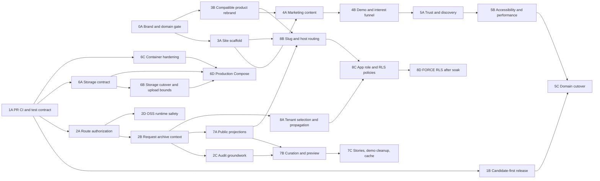

> Status: Reviewed execution blueprint · Last updated: 2026-07-13

# Production readiness: next slices and public-site program

Status: Reviewed execution blueprint<br>
Prepared: 2026-07-13<br>
Planning base: `main` at `71570de`<br>
Source roadmap: [`docs/production-readiness.md`](../docs/production-readiness.md) / [PR #21](https://github.com/erichare/kinresolve/pull/21)<br>
Selected brand: **Kin Resolve** (`kinresolve.com`), owner-approved and pending formal clearance

Current execution update (2026-07-13):

- The GitHub repository and local checkout have been renamed from KinSleuth to Kin Resolve.
- The owner registered `kinresolve.com` through Cloudflare. Registration establishes
  ownership of the domain; it does not replace formal name/trademark clearance.
- The independent marketing site is implemented under `site/`, with a protected preview
  in the isolated `kinresolve-marketing` Vercel project. Static-export checks and live
  route probes pass; the owner approved the preview.
- Cloudflare Email Routing for `beta@kinresolve.com` is active and delivery-tested.
  Web-traffic DNS remains unchanged.
- Public launch remains gated on production deployment, web-domain cutover/rollback
  checks, and formal clearance.

## Objective

Move the repository from the merged account-identity core to three honest release
outcomes without conflating them:

1. A polished, independently deployable public marketing site that can launch early
   with a beta-interest path and self-hosting CTA.
2. An OSS 1.0 release candidate that is secure, portable, migration-safe, and tested
   on the production Docker path.
3. A privacy-correct, tenant-scoped public family archive that can later support the
   hosted product.

This plan intentionally does **not** open a paid hosted beta. Billing, invitations,
durable jobs, tested disaster recovery, observability, counsel-approved DNA/privacy
flows, and the grounded GPS-AI differentiator remain required hosted-beta gates after
this tranche.

## Recommended decisions

These are the defaults used by the rest of the plan. Change them in PR slice 0A before
implementation rather than allowing later slices to fork silently.

| Decision | Recommendation | Why |
| --- | --- | --- |
| Product name | **Kin Resolve** | Distinctly names the product's conflict-resolution and research-conclusion role without claiming absolute historical proof. The public tagline must supply the genealogy context. |
| Primary domain | `kinresolve.com` | Registered by the owner through Cloudflare on 2026-07-13. Domain ownership is confirmed; formal name/trademark clearance remains separate. |
| Public-site architecture | Separate static marketing application in this repository, deployed independently | The current `/` is a database-backed family archive. A separate site keeps public marketing free of private runtime/data dependencies and permits independent deploy/rollback. |
| Host layout | `kinresolve.com` marketing; `www` redirects to apex; `app.kinresolve.com` product; public archives initially under `app.kinresolve.com/a/<slug>` | Separates acquisition from authenticated/private runtime while preserving a clean seam for custom domains later. |
| Self-host behavior | Keep `/` as the local public archive and `/app` as the private workspace | Self-hosters should not need multiple domains or hosted routing. |
| Initial CTA | “Apply for the private beta” plus “View on GitHub”; sign-in is product-only | The flow records interest; open registration, billing, email verification, invitations, and hosted onboarding are not ready. |
| Demo | Permanent synthetic demo only; never point “demo” at a real protected workspace | Current `/kinsleuth` links “Open demo workspace” to `/app`, which is neither an anonymous demo nor open signup. |
| Indexing | Marketing indexed; login/setup/app noindex; family archives noindex until an owner opts in | Prevents accidental indexing of family names and unfinished tenant archives. |

### Name shortlist

The following `.com` names returned `404` from the authoritative Verisign RDAP endpoint
on 2026-07-13, meaning no registration record was present at that moment. GitHub user
and npm package lookups also returned not found for Kin Resolve, Kin Casebook, and Kin
Verity. Re-check every namespace immediately before purchase.

| Rank | Name | Domain | Positioning | Main caution |
| --- | --- | --- | --- | --- |
| 1 | **Kin Resolve — selected** | `kinresolve.com` | Conflict resolution and research conclusions | Less immediately obvious as genealogy software; pair it with a clear category tagline. |
| 2 | Kin Casebook | `kincasebook.com` | Private investigation workspace | Can sound legal/criminal. |
| 3 | Kin Verity | `kinverity.com` | Trust and accuracy | “Truth” language risks overstating historical certainty. |
| 4 | Cited Kin | `citedkin.com` | Citation-grounded conclusions | “Cited,” “sighted,” and “site” weaken the radio test. |

`Sourced Kin` was rejected after owner review. In speech it is nearly indistinguishable
from `Source Kin`, forcing a recurring “with a d” clarification and creating typo,
email, and direct-navigation leakage. That adjacent name's `.com` resolves and its
GitHub identity and repository are already occupied. This is sufficient brand risk even
without evidence of a same-category genealogy product.

`kinsleuth.com` is not an acquisition assumption. It is an active genealogy portal
created in 2007, and the user confirmed they do not own it. Using another KinSleuth TLD
would not remove same-category brand confusion.

## Verified baseline and corrections to PR #21

The plan begins from current-head truth, not the status snapshot in the merged document:

- PR #20 and PR #21 are merged. The roadmap still calls #20 open at
  [`docs/production-readiness.md:27`](../docs/production-readiness.md#L27) and tells the
  reader to merge it at line 245.
- `main` is ahead of the latest production release. Production is healthy on v0.17.4,
  while the merged identity changes have not been released.
- Local `npm run lint`, `npm run typecheck`, `npm test`, and `npm run build` pass. The
  default unit run reports 134 passing and 65 skipped database tests. With a disposable
  `TEST_DATABASE_URL`, the full suite reports 198 passing and one intentionally skipped
  large test; the large test passes separately.
- The only GitHub Actions workflow runs on published releases, not pull requests:
  [`.github/workflows/vercel-release.yml`](../.github/workflows/vercel-release.yml).
- The release workflow still requires the retired `KINSLEUTH_APP_PASSWORD` and never
  runs `db:migrate`, although production disables automatic migrations.
- Any archive member passes the proxy. Nearly every mutating route omits a role/permission
  check; only the AI route currently calls `assertPermission`.
- Public copy says MIT even though the package and repository are AGPL-3.0-only:
  [`components/public-shell.tsx:67`](../components/public-shell.tsx#L67) and
  [`app/kinsleuth/page.tsx:42`](../app/kinsleuth/page.tsx#L42).
- Marketing claims object storage and audited AI before those capabilities exist.
- The public homepage reads the entire workspace, exposes counts from private imports,
  and mixes real archive data with hard-coded demo rows and artwork.
- Imported facts default to private, but there is no fact-level curation API/UI. The
  promised “selected public facts” workflow is therefore incomplete.
- “GEDCOM of any size” in the roadmap conflicts with the implemented 25 MB upload limit.
- Docker Compose is a development stack (`next dev`, source bind mounts, fixed credentials,
  exposed database/storage ports), not an OSS 1.0 production path.

## Release gates

### Gate A: public prelaunch

May open after PR slices 0A, 1A, 1B, 3A, 3B, 4A, 4B, 5A, 5B, and 5C.

- Cleared name and owned domain.
- Truthful product claims and correct AGPL labeling.
- Static marketing deployment has no database, workspace, or family-data dependency.
- Self-host and beta-interest CTAs work; live signup and payment are not implied. The
  beta-interest path is either a labeled email/GitHub link or an owner-approved external
  processor/serverless endpoint with explicit retention, deletion, outage fallback, and
  delivery monitoring. The static site never depends on the family/product database.
- Family-publication copy is explicitly labeled “in development” or “private preview”
  until Gate C. The claim registry must make this mechanically reviewable.
- The product remains closed to the existing owner cohort; Gate A does not enable open
  signup, invitations, collaboration, billing, or public access to private workspaces.
- Accessibility, privacy-safe analytics, metadata, minimal synthetic uptime/form checks,
  and domain rollback are verified. Full product observability remains a hosted gate.

### Gate B: OSS 1.0 release candidate

May be cut after PR slices 1A, 1B, 2A, 2B, 2C, 2D, 6A, 6B, 6C, and 6D.

- PR CI and release migration choreography are green.
- Mutations are deny-by-default and role tested.
- Production Compose and object storage work from a fresh clone and across restart/upgrade.
- Documentation states tested GEDCOM size/record limits instead of “any size.”
- Full export and privacy gates remain intact.
- Cookie-authenticated mutations enforce origin/CSRF policy; request/body limits, AI and
  export ceilings, product security headers, and safe external error responses are in
  place. Durable distributed limiting may remain a hosted-only gate.

### Gate C: promoted public family archives

May be promoted after PR slices 2A, 2B, 2C, 2D, 7A, 7B, 7C, 8A, 8B, 8C, and 8D.

- Fact/source publication is explicit and previewable; unimplemented public content
  types such as Stories are absent outside explicit synthetic demo mode.
- Public reads select public projections only; no full-workspace hydration.
- Tenant resolution and RLS cross-tenant tests pass.
- Archives default to noindex and can opt in deliberately.

### Not a gate in this tranche: hosted beta

Do not accept payments or general hosted signups after Gate A, B, or C alone. Hosted beta
still requires, at minimum:

- durable rate limiting and background jobs;
- structured logs, error tracking, metrics, alerts, and support tooling;
- provider PITR plus offsite archive backups and a successful restore drill;
- email verification/reset, invitations, and member management;
- billing, entitlements, metering, and cancellation/refund flows;
- counsel-approved privacy/ToS/consent/retention/deletion language;
- complete DSAR and deletion across database, objects, jobs, logs, and backups;
- living-person/DNA redaction and explicit external-AI transfer consent;
- grounded citations/abstention before marketing the GPS-AI differentiator as complete.

## Dependency graph and parallel work

The numbered headings below are workstreams. Lettered IDs are the executable PR slices;
each lettered slice is one independently reviewable PR and rollback domain. A workstream
must be split further if one lettered slice grows beyond that boundary.



Recommended waves:

1. **Wave 0:** 0A and 1A; then 1B.
2. **Wave 1:** 2A, 3A, 3B, 6A, and 6C in parallel after their dependencies.
3. **Wave 2:** 2B/2C/2D, 4A/4B, 6B/6D, and 7A/7B/7C on their dependency chains.
4. **Wave 3:** 5A/5B/5C can launch the marketing site while 8A/8B/8C/8D complete the
   multi-tenant public-archive contract.

The public-site program is Workstreams 0, 3, 4, and 5 directly, with Workstreams 7 and 8 providing
the family-archive product the site eventually sells. It is therefore a major workstream,
not a landing-page task.

### Immediate execution window: first eight PRs

| Order | PR slice | Outcome |
| --- | --- | --- |
| Parallel start | 0A | Clear and register the owner-selected Kin Resolve name/domain; lock host/CTA/demo decisions. |
| Parallel start | 1A | Full PR CI, current release contract, AGPL/claim corrections. |
| Next | 1B | Candidate-first, migration-safe, retryable release pipeline. |
| Parallel | 2A | Close the current role-enforcement gap before adding users. |
| Parallel | 3A | Independent static marketing scaffold and design foundation. |
| Next | 3B | Compatibility-preserving product display rebrand. |
| Next | 4A | Substantial evidence-first marketing content and claim registry. |
| Next | 4B | Synthetic demo plus privacy-bounded beta-interest path. |

This window deliberately makes the public site five of the first eight PRs while still
front-loading release and authorization risks. 5A/5B/5C then form the public cutover,
and 2B/2C/2D plus Workstream 6 continue the OSS lane in parallel.

## Cross-cutting invariants

Every implementation PR must preserve these unless its context explicitly changes them:

1. Anonymous responses never include living, private, sensitive, DNA, case, AI-run,
   import, raw-record, backup, or private source metadata.
2. Authorization derives actor, role, and archive from the server session; never from
   request input.
3. All private reads/writes carry an explicit archive ID. New routes are private by
   default; public routes are an explicit allowlist.
4. Persisted compatibility survives the rebrand:
   - accept snapshots whose discriminator is `product: "KinSleuth"`;
   - preserve/read existing `kinsleuth:v0.3:*` local keys;
   - continue parsing `_KS_*` GEDCOM tags and `SOUR KINSLEUTH`;
   - accept legacy `KINSLEUTH_*` environment variables through at least OSS 1.0;
   - do not silently rename storage keys, buckets, database names, or Docker volumes.
5. Product/marketing claims are backed by a test, implementation link, or clearly marked
   roadmap status. No “audited,” “compliant,” “any size,” or “production ready” claim
   without evidence.
6. Public screenshots, Open Graph images, analytics, and demos use synthetic data only.
7. Schema changes are forward-only and expand/contract. Application rollback must not
   require a destructive down migration.
8. A code rollback never disables authentication, permission checks, privacy gates, or
   tenant isolation.

## Standard PR contract

Each lettered PR slice should use one focused branch and one mergeable PR. Numbered
workstreams are not permission to combine their lettered slices. The PR body must contain:

- user-visible outcome;
- migration/config/deploy changes;
- security and privacy impact;
- exact commands and results;
- screenshots for public UI at mobile and desktop widths;
- rollback procedure;
- follow-ups explicitly excluded from the slice.

Before each PR, refresh `main`, check the live release/workflow state, and confirm the
worktree is clean. Unless the slice narrows the set, run:

```bash
npm ci
npm run lint
npm run typecheck
TEST_DATABASE_URL=postgres://... npm test
TEST_DATABASE_URL=postgres://... npm run test:db:large
npm run build
npm audit --omit=dev --audit-level=high
```

Use a disposable Postgres/pgvector database. Never point test or migration verification
at production data.

---

## Workstream 0 — Brand, domain, and launch-contract gate

**Owner:** both; owner makes the name/legal/domain decisions, engineering records and
implements the contract.<br>
**Can run with:** 1A.<br>

### PR slices

| ID | PR | Depends on | Rollback boundary |
| --- | --- | --- | --- |
| 0A | `docs: lock brand, domain, and public launch contract` | None | Decision record and domain purchase only; no code/DNS rename. |

### Cold-start context

The original roadmap assumes `kinsleuth.com` can be registered. It is instead an active
genealogy site, and the user does not own it. The repository contains about 139 case-
insensitive KinSleuth matches across 37 tracked files (excluding the lockfile/build
artifacts), including display copy, environment variables, snapshot validation, GEDCOM
metadata, Docker defaults, tests, and runtime health output. A blind global replacement
would break persisted data and self-hosted upgrades.

### Tasks

1. Re-check candidate domain, GitHub organization/user, package, container, and major
   social-handle availability immediately before deciding.
2. Perform and record a preliminary USPTO, EUIPO, WIPO, state/common-law, app-store,
   GitHub, package-registry, and web search for the finalists. Have counsel clear the
   chosen name before public commitment; do not describe this check as legal advice.
3. Record the owner-selected canonical spelling: `Kin Resolve` in prose and
   `KinResolve` where spaces are unavailable. Treat formal clearance and namespace
   acquisition as still open until their evidence is recorded.
4. **Completed for the apex on 2026-07-13:** the owner registered `kinresolve.com`
   through Cloudflare. Confirm registrar MFA, WHOIS privacy, auto-renew, and account
   recovery; evaluate defensive variants separately. Registration does not close the
   formal-clearance gate. Do not cut production DNS over yet.
5. Add `docs/brand-and-domain.md` containing:
   - display name, compact name, repository/package/container names;
   - apex, `www`, app, demo, docs, status, support, security, privacy, and legal URLs;
   - canonical capitalization and pronunciation;
   - product promise, audience, primary CTA, and claims that are intentionally deferred;
   - durable internal identifiers that must remain backward compatible;
   - domain/DNS ownership and recovery roles without secrets.
6. Record the public-surface architecture decision:
   - independently deployed static marketing app in this repository (recommended);
   - product runtime on `app.<domain>`;
   - hosted public archives under `/a/<archiveSlug>`;
   - self-host fallback keeps `/` and `/app` on one host.
7. Choose the permanent demo contract: a synthetic, resettable archive with no route to
   owner setup or real production data.
8. Update `docs/production-readiness.md` only where facts are now stale: merged PR #20,
   chosen brand/domain decision, and public-site architecture. Preserve historical PR
   references; do not rewrite the whole roadmap in 0A.

### Verification

- A fresh agent can find every canonical public value in one decision document.
- The domain is visible in the owner's registrar account with MFA and auto-renew.
- Exact-name search evidence and counsel status are recorded with dates.
- `rg -n -i 'kinsleuth|kin sleuth'` is categorized into display/config/persisted-contract
  groups; it is not expected to be zero yet.
- No code, DNS, GitHub repository, or package rename occurs before this gate is approved.

### Exit criteria

- Owner approves a name and domain in writing.
- Counsel/clearance status is explicit enough to authorize or block the rebrand.
- The host/path/CTA/demo decisions are closed.
- Workstream 3 can execute without inventing brand or routing choices.

### Rollback

This slice changes documentation and domain ownership only. If clearance fails, abandon
the candidate before code/DNS changes, select the next candidate, and amend the decision
record. Do not let a sunk domain-registration cost override a conflict.

---

## Workstream 1 — Production contract, PR CI, and release safety

**Owner:** engineering, with owner access for GitHub/Vercel/Supabase settings.<br>
**Can run with:** 0A.<br>

### PR slices

| ID | PR | Depends on | Rollback boundary |
| --- | --- | --- | --- |
| 1A | `ci: enforce full pull-request coverage and truthful release contracts` | None | CI/scripts/docs/copy only; no production deploy choreography. |
| 1B | `ci: deploy immutable candidates before stable release` | 1A | Protected candidate, migration, promotion, and rollback workflow only. |

### Cold-start context

The only workflow, `.github/workflows/vercel-release.yml`, starts after a stable GitHub
release is already published. It has no PR checks, still validates the retired shared-
password secret, builds and deploys without `db:migrate`, and smoke-tests only after
production promotion. `npm test` skips database-gated suites without
`TEST_DATABASE_URL`; the current `test:db` script covers only three files. Git
deployments are disabled in `vercel.json`, so there is no automatic preview safety net.

### Tasks

1. **[1A]** Add `.github/workflows/ci.yml` on pull requests and pushes to `main` with:
   - Node 22 and `npm ci`;
   - pinned pgvector Postgres service;
   - lint, typecheck, full Vitest with `TEST_DATABASE_URL`, production build, and audit;
   - large GEDCOM test in a separate job or explicit nightly/manual job if runtime is
     too expensive for every PR;
   - Docker build smoke test once 6D lands.
2. **[1A]** Normalize scripts so names describe coverage:
   - default fast tests may remain database-free for local iteration;
   - CI must run all database-gated suites, not a hand-maintained three-file list;
   - retain a distinct large-import command.
3. **[1A]** Repair the release environment contract:
   - remove `KINSLEUTH_APP_PASSWORD`;
   - validate `AUTH_SECRET`, database, blob/storage, cron, canonical app URL, and the
     selected new-domain variables when 3B lands;
   - derive the production smoke-test URL from deploy output/config, not a hard-coded
     `https://kinsleuth.vercel.app`.
4. **[1B]** Replace the release-published trigger with a protected candidate-first flow:
   - trigger from `workflow_dispatch` or an approved release-candidate tag/commit in a
     protected GitHub environment; keep a concurrency group for the production database;
   - build and identify one immutable artifact before any migration;
   - require a demonstrably restorable provider PITR/backup point, not merely the
     existence of a backup setting;
   - run the existing idempotent migration ledger under its database advisory lock;
   - use expand/contract migrations and prove both the old and candidate application can
     operate against the expanded schema during the deployment window;
   - verify expected migration/schema version;
   - deploy a non-aliased candidate URL, smoke test health/auth/public behavior, then
     promote/alias it;
   - publish the stable GitHub release only after promotion succeeds;
   - document retry/idempotency, application alias rollback, and database forward-fix.
     Never auto-run down migrations.
5. **[1A]** Source the runtime version from one release/build value. Remove version literals that
   can drift from `package.json` and the release tag.
6. **[1B]** Add a release runbook covering first release of migration 003, owner setup, session
   invalidation on domain changes, rollback, and secret rotation.
7. **[1A]** Fix immediate public truth bugs that should not wait for the rebrand:
   - AGPL, not MIT;
   - no “audited” AI claim before audit logs exist;
   - no object-storage/production-Compose claim before 6D;
   - no “any size” import claim; state measured/tested limits.

### Verification

```bash
npm run lint
npm run typecheck
TEST_DATABASE_URL=postgres://... npm test
TEST_DATABASE_URL=postgres://... npm run test:db:large
npm run build
npm audit --omit=dev --audit-level=high
DATABASE_URL=postgres://fresh-db... npm run db:migrate
DATABASE_URL=postgres://fresh-db... npm run db:migrate
```

Also verify an upgrade from a v0.17.4-shaped database, not only a fresh schema. Exercise
the protected candidate workflow in a non-production environment; retry it after an
intentional interruption; prove smoke-test failure neither changes the production alias
nor publishes a stable GitHub release. Restore the rehearsal recovery point into a clean
database and validate it before trusting the production procedure.

### Exit criteria

- Branch protection can require CI that includes every database-gated suite.
- Migration 003 has a rehearsed production upgrade path.
- Release validation contains no retired secret.
- One immutable candidate is tested before promotion; the stable release is published
  last; retry, rollback, forward-fix, and recovery-point restore are demonstrated.
- Public copy is factually consistent with AGPL and implemented capability.

### Rollback

Revert CI/workflow code if it blocks valid releases, but keep the retired-secret removal
and corrected public claims. Roll back application aliases only when the migration is
backward compatible. Otherwise forward-fix the application/database pair.

---

## Workstream 2 — Authorization, request archive context, and OSS safety

**Owner:** engineering; owner confirms the permission policy.<br>
**Can run with:** Workstreams 3 and 6.<br>

### PR slices

| ID | PR | Depends on | Rollback boundary |
| --- | --- | --- | --- |
| 2A | `security: make API access explicit and permission-gated` | 1A | Route classification, shared guard, and role matrix only. |
| 2B | `security: propagate request archive context explicitly` | 2A | HTTP request archive plumbing only; no tenant-selection or RLS change. |
| 2C | `security: add privacy-safe mutation audit groundwork` | 2B | Additive audit schema/service and request IDs only. |
| 2D | `security: add the OSS runtime safety envelope` | 2A | Origin/CSRF, limits, safe errors, and product headers; numeric controls remain configurable. |

### Cold-start context

`proxy.ts` currently treats any membership as sufficient for all protected paths. Roles
and permissions exist in `lib/rbac.ts`, but representative mutations such as archive
settings, person publishing, imports, cases, source uploads, and DNA update/delete do
not call them. The protected-prefix list is manually duplicated, so a new API can be
accidentally public by omission. Most store calls still choose the archive from the
environment instead of the session context.

### Proposed permission decisions

| Surface | Permission | Recommended roles |
| --- | --- | --- |
| Archive branding/settings | `settings:manage` | owner, admin |
| Person/fact/source/story publication | `archive:publish` | owner, admin, editor |
| GEDCOM import/repair/staging | `imports:manage` | owner, admin |
| Full private export | new `archive:export` | owner, admin; do not give all viewers by implication |
| Case/task mutation | `cases:write` | owner, admin, editor |
| Evidence linking/source creation | `evidence:write` plus a new `sources:write` if source editing grows | owner, admin, editor; contributor for evidence only |
| DNA import/update/delete/analyze | `dna:write` | owner, admin, editor |
| Whole-tree external AI | `ai:whole-tree` plus explicit consent later | owner, admin |
| Member/role changes | `users:manage` | owner, admin, with owner-demotion safeguards |

### Tasks

1. **[2A]** Introduce a server-only guard such as `requirePermission(request, permission)` that:
   - returns consistent 401 for no session/membership and 403 for insufficient role;
   - returns actor ID, archive ID, role, and request ID to the handler;
   - never accepts role/archive from the request body or query;
   - can be unit tested without Next proxy behavior.
2. **[2A]** Make APIs private by default. Maintain one explicit public allowlist for health,
   auth callbacks, cron with its own bearer check, and privacy-projected public queries.
   Eliminate duplicated prefix lists where practical.
3. **[2A]** Apply the permission matrix to every route, including GET routes that return
   private data and all mutations. Do not change tenant-selection semantics in this PR.
4. **[2B]** Pass the session-derived archive context explicitly through every HTTP page,
   handler, query, and mutation into the store layer. A request path must not fall back
   to `KINSLEUTH_ARCHIVE_ID` after it has an authenticated session context. Workstream 8
   later changes how a multi-membership session selects that context and covers jobs,
   storage, cache, backups, public slugs, and RLS.
5. **[2C]** Add an append-only audit table/service with actor, archive, action, target type/ID,
   result, timestamp, and request ID. Do not log payloads, DNA values, secrets, or private
   fact text. Record failed authorization attempts separately from successful mutations.
6. **[2A/2B/2C]** Add role-matrix route tests for owner/admin/editor/contributor/viewer/anonymous and
   membership-less sessions. Include route-discovery coverage that fails when a new API
   has no explicit access classification.
7. **[2A/2C]** Add an audited owner-recovery CLI/runbook. Do not add a production environment flag
   that bypasses authorization globally.
8. **[2D]** Add the minimum safety controls required for a public OSS 1.0 candidate:
   - same-origin/CSRF enforcement for cookie-authenticated mutations, with explicit auth
     callback and service-token exceptions;
   - route/body/file limits for source, DNA, GEDCOM, AI, and export paths;
   - configurable AI time/token/cost ceilings and export concurrency/size controls;
   - CSP, frame-ancestors, referrer, content-type, and permissions headers for the
     product runtime;
   - common validation and external error responses that do not return internal exception
     text or secrets;
   - conservative per-instance limits for self-host mode. Durable distributed limits
     remain a hosted-beta requirement.
9. **[2D]** Add negative tests for cross-origin mutations, oversized/invalid bodies,
   ceiling exhaustion, unsafe error text, and required headers.

### Verification

- Every API route is listed exactly once as public, cron/service-authenticated, or
  session/permission protected.
- Mutation tests prove a viewer cannot change settings, publication, cases, sources,
  imports, or DNA.
- Contributor/editor boundaries match the approved matrix.
- 401/403 responses do not leak internal exception messages.
- Audit rows contain actor/archive/action/result but no sensitive body data.
- Cross-origin cookie mutations fail; request/AI/export bounds and product headers are
  tested; public errors do not expose internals.
- Full unit/database/build checks from the standard PR contract pass.

### Exit criteria

- No mutation relies on proxy membership alone.
- No handler derives role/archive from request input or `KINSLEUTH_ARCHIVE_ID` when a
  session exists.
- Adding an unclassified API causes a test failure.
- 2A/2B/2C/2D together are strong enough to support the OSS 1.0 gate and tenant work.

### Rollback

Keep the additive audit schema. If a permission mapping causes a lockout, correct that
mapping or use the audited owner-recovery tool. Numeric limits and CSP enforcement can
be relaxed through reviewed configuration/report-only mode if they cause regressions.
Never roll back to a global membership-only, cross-origin, or unbounded bypass.

---

## Workstream 3 — Backward-compatible rebrand and public-site platform

**Owner:** engineering, with owner design/brand approval.<br>
**Can run with:** Workstreams 2 and 6.<br>

### PR slices

| ID | PR | Depends on | Rollback boundary |
| --- | --- | --- | --- |
| 3A | `feat(site): scaffold the independent marketing application` | 0A, 1A | Static site, brand config, design foundation, and preview deployment only. |
| 3B | `feat: rebrand product display without breaking persisted formats` | 0A, 1B | Product UI/docs/config aliases and compatibility readers; no repository rename. |
| 3C | `chore: rename repository, package, and hosting identifiers` | 3B | Optional owner-controlled repository/package/hosting rename with redirect verification. Not required for Gate A. |

### Cold-start context

Marketing, the family archive, authentication, and the product currently share one
Next.js application, root metadata, global stylesheet, and `PublicShell`. The database-
backed family archive owns `/`; `/kinsleuth` is a small product page. The new public site
must not inherit database availability, private archive data, or auth routing. At the
same time, internal persisted identifiers from the old name must survive upgrades.

### Tasks

1. **[3A]** Add a separate static marketing application under `site/` in the same repository,
   with its own build command and Vercel project/root. The 0A ADR chooses Next
   static export or Astro after a minimal build/deploy spike; do not introduce a shared
   runtime server.
2. **[3A]** Add a machine-readable root brand config consumed by the marketing build and,
   in 3B, the product build. Include display name, compact name, canonical URLs,
   repository URL, support/security/legal contacts, social image defaults, and feature-
   status flags. Validate it at build time.
3. **[3A/3B]** Create separate visual/shell concepts without combining their implementation:
   - **3A:** marketing shell for acquisition/product narrative;
   - **3B:** archive shell for a family's public history, auth shell for sign-in/setup/
     recovery, and existing app shell for private work.
   Do not make archive branding mutate the product marketing brand.
4. **[3A]** Build the marketing design foundation: type scale, color/contrast tokens, spacing,
   buttons/links, navigation/footer, content width, editorial imagery rules, focus/
   reduced-motion behavior, and responsive breakpoints. Keep the strong archival/
   research aesthetic while making the product promise legible to a first-time visitor.
5. **[3B]** Rebrand user-facing UI, docs, descriptive package metadata (not registry/
   repository identifiers), health output, screenshots, and demo labels from the
   approved decision record.
6. **[3B]** Preserve compatibility explicitly:
   - accept old and new snapshot product discriminators; export the new one;
   - parse existing GEDCOM source/tag identifiers; do not rewrite imported records;
   - read new environment variables first, then legacy `KINSLEUTH_*` aliases with one
     startup deprecation warning;
   - keep object keys, database IDs, and Docker volume names stable;
   - document that domain movement requires users to sign in again.
7. **[3A]** Give the marketing deployment preview URLs independent of the product's disabled Git
   auto-deploy policy. Require preview build checks in CI.
8. **[3A/3B]** Add a host/path contract test fixture for apex, `www`, app, demo, and self-host mode.
   Do not implement multi-tenant archive resolution in 3A or 3B.
9. **[3C]** Owner may rename the GitHub repository/organization only after links and release
   automation are updated; rely on GitHub redirects temporarily and verify clone/docs.

### Verification

```bash
npm --prefix site ci
npm --prefix site run lint
npm --prefix site run test
npm --prefix site run build
npm run lint
npm run typecheck
npm test
npm run build
```

- Build the marketing app with no `DATABASE_URL`, auth, blob, AI, or family data.
- Import a pre-rebrand workspace snapshot and GEDCOM fixture successfully.
- Start with legacy environment variables only and verify a warning plus correct behavior.
- Confirm existing Docker volumes and object keys are reused after the display rename.
- Verify marketing, archive, auth, and app shells at 320, 768, and 1440 px.

### Exit criteria

- 3A public marketing can deploy independently and statically.
- Canonical brand/domain values have one validated source.
- 3B changes the user-facing name without breaking existing persisted formats/configuration.
- Shells and data dependencies are separated enough for Workstream 4 to focus on content.

### Rollback

3A rolls back by aliasing the previous static deployment. 3B rolls back product display
separately, while keeping all added old-format readers and environment aliases;
compatibility code is not rolled back. 3C uses GitHub/hosting redirects and an explicit
reverse-rename runbook. Do not rename existing persisted storage or volumes during any
rollback.

---

## Workstream 4 — Marketing site v1: story, evidence, and beta interest

**Owner:** both; engineering builds, owner approves positioning/copy/pricing status.<br>
**Can run with:** Workstream 7.<br>

### PR slices

| ID | PR | Depends on | Rollback boundary |
| --- | --- | --- | --- |
| 4A | `feat(site): publish the evidence-first product story` | 3A, 3B | Static information architecture, pages, copy, screenshots, and claim registry. |
| 4B | `feat(site): add a synthetic demo and privacy-bounded beta-interest path` | 4A | Demo links/assets and independently operated interest endpoint or labeled contact fallback. |

### Cold-start context

The public site must sell the product without implying unfinished capabilities. Current
strengths include GEDCOM provenance, reviewable imports, cases/evidence/tasks, DNA
triage, person-level privacy gates, account memberships, full GEDCOM export, and an AGPL
self-host path. Granular fact/source/story publication is **not** a shipped marketing
claim until Workstream 7 passes. Object-storage portability, tenant archives, billing,
collaboration, grounded AI, compliance, and disaster recovery are also roadmap work.

### Information architecture

1. **Home** — evidence-first genealogy; private research with controlled publication
   clearly labeled in development/private preview until Gate C;
   primary beta-interest CTA; synthetic product proof.
2. **Product** — research cases, sources/provenance, DNA triage, publication controls,
   and the private/public dual face. Clearly label implemented vs planned.
3. **Method / GPS** — explain reasonably exhaustive search, source evaluation, conflict
   resolution, and cited conclusions. Do not claim certification or complete GPS AI.
4. **Open source / self-host** — AGPL terms in plain language, current install path,
   measured limits, GitHub/docs links, export/anti-lock-in story, and honest limitations.
5. **Hosted beta / pricing** — beta interest and intended value; use “pricing to be announced”
   until the owner approves numbers. No fake checkout or open signup.
6. **Security & privacy architecture** — factual data-flow and privacy controls, distinct
   from the counsel-authored legal Privacy Policy.
7. **About / contact** — project purpose, maintainer identity if approved, support and
   security contact paths.
8. **Synthetic demo** — real product screens/data from fixtures only; no link into a
   protected real archive.

### Tasks

1. **[4A]** Create a claim registry in `site/content/claims.*` or documentation. Each material
   claim links to shipped code/test/docs or is labeled planned/beta. CI fails if a claim
   for family publishing is marked shipped before 7A/7B/7C evidence is linked.
2. **[4A]** Write concise copy around the chosen wedge: sourced conclusions, unresolved conflicts,
   private investigation, and selective family publishing.
3. **[4A]** Use current synthetic screenshots or create replacement captures through a repeatable
   fixture/capture script. Remove names/counts from real production data.
4. **[4B]** Implement the beta-interest path without coupling the static site to the
   family/product runtime. The 0A decision must name one of:
   - a labeled email or GitHub-interest link with no site-side lead storage; or
   - an owner-approved external lead processor/serverless endpoint with a DPA/owner,
     retention/deletion contract, outage fallback, delivery alert, and synthetic check.
   If the endpoint is selected, minimize data to:
   - email, explicit consent version, timestamp, locale/source, and optional research role;
   - double opt-in when transactional email exists;
   - rate limiting, generic responses, deletion/unsubscribe path, and retention policy;
   - feature flag the form until approved privacy text and delivery configuration exist.
   If those prerequisites are absent, launch with a mailto/contact or GitHub interest
   link rather than silently storing leads.
5. **[4B]** Add a real synthetic demo entry point or remove “demo” CTAs until one exists.
6. **[4A]** Keep sign-in secondary and route it explicitly to `app.<domain>/login`; do not present
   `/setup` or self-host owner creation as hosted signup.
7. **[4A/4B]** Add content and component tests for every primary navigation/CTA and for claim status.
8. **[4A]** Capture owner approval for homepage headline, CTA, screenshots, pricing language,
   founder/about language, and use of “Genealogical Proof Standard.”

### Verification

- Crawl all internal links in the static build; no broken link, placeholder, or protected
  demo route.
- If an endpoint is selected, verify valid, invalid, duplicate, bot/rate-limited,
  provider-failure, delivery-alert, deletion, and unsubscribe cases. If the contact/
  GitHub fallback is selected, prove the site exposes no lead-collection endpoint.
- Test without JavaScript for core content/navigation.
- Review every claim against the registry and current repository.
- Verify no production family name, count, email, DNA value, or archive label exists in
  source, screenshots, generated HTML, analytics payloads, or OG assets.
- Owner signs off mobile and desktop screenshots for every page.

### Exit criteria

- A stranger can understand who the product is for, why it differs, what is available
  now, and what action to take.
- The site has a working, privacy-conscious interest CTA without implying paid beta or
  introducing a product-database dependency.
- Product proof is synthetic, truthful, and repeatable.
- Site content is deep enough to be a meaningful public product surface.
- Family-publication claims remain planned/private preview until Gate C.

### Rollback

Static deployment can be aliased back instantly. Disable the interest-form feature flag if
delivery/retention fails, preserving unsubscribe/deletion processing for existing leads.
Never delete consent or suppression records merely to roll back UI.

---

## Workstream 5 — Public-site trust, discovery, quality, and domain cutover

**Owner:** both; owner controls DNS/legal/analytics accounts, engineering implements.<br>
**Can run with:** Workstream 8 after the host contract is stable.<br>

### PR slices

| ID | PR | Depends on | Rollback boundary |
| --- | --- | --- | --- |
| 5A | `feat(site): add trust, discovery, headers, and privacy-safe measurement` | 4B | Metadata/trust/analytics/static-site headers and minimal synthetic monitoring. |
| 5B | `test(site): enforce accessibility and performance budgets` | 5A | Browser/a11y/performance automation and fixes only. |
| 5C | `ops(site): cut over the cleared public domain` | 1B, 5B | DNS, TLS, host redirects, post-cutover checks, and rollback runbook; no product data mutation. |

### Cold-start context

The current app emits one generic title/description, no canonical/OG/Twitter/JSON-LD,
and 404s for robots/sitemap. Auth pages are not explicitly noindex. There is no public
browser/accessibility suite despite Playwright being installed. Analytics must never
collect family/archive/person/DNA data. Legal privacy/ToS text must come from counsel;
engineering may publish an accurate security/privacy architecture page but not invent
legal promises.

### Tasks

1. **[5A]** Add route-specific titles/descriptions, canonical URLs, Open Graph/Twitter metadata,
   favicons, web manifest, `robots.txt`, sitemap, and appropriate structured data.
2. **[5A]** Enforce indexing policy:
   - marketing pages index/follow;
   - auth/setup/app noindex;
   - family archives noindex by default, owner opt-in later;
   - no private/family identifiers in canonical or social images unless explicitly
     public and opted in.
3. **[5A]** Add factual trust surfaces: AGPL/source link, security contact and disclosure policy,
   accessibility statement/contact, system status link when available, and counsel-
   approved Privacy Policy/Terms links. Do not publish placeholder legal text as final.
4. **[5A]** Add privacy-preserving, cookie-free aggregate analytics with a small event vocabulary:
   CTA click, GitHub click, demo view, beta-interest start/complete, and outbound sign-in.
   Disable or normalize analytics on `/a/*`; never add session replay.
5. **[5A]** Add security headers suitable for the static site. Product runtime headers
   belong to 2D. Include CSP, frame-ancestors, referrer policy, content-type protections,
   and permissions policy. Stage CSP in report-
   only mode before enforcement if third-party scripts are unavoidable.
6. **[5B]** Add public UI automation:
   - Playwright route/CTA/404/redirect tests;
   - axe or equivalent WCAG checks;
   - keyboard navigation, focus order, mobile menu, reduced motion, and 200% zoom;
   - viewports 320, 768, and 1440;
   - correct the confirmed warning-text contrast failure and meaningful image alt text.
7. **[5B]** Set performance budgets and CI checks. Recommended initial mobile targets: Lighthouse
   performance/accessibility/SEO/best-practices >= 90, LCP <= 2.5 s, CLS <= 0.1, INP
   <= 200 ms on the production-like preview. Record exceptions, do not waive silently.
8. **[5C]** Rehearse domain cutover:
   - lower TTL;
   - verify TLS and apex/`www` redirects on a staging hostname;
   - configure SPF/DKIM/DMARC for support/beta-interest mail separately;
   - switch apex to marketing and app subdomain to product;
   - verify auth callbacks/cookies/CORS/canonical/sitemap/analytics;
   - retain old Vercel URL and previous DNS values for rollback.
9. **[5A/5C]** Add minimal synthetic checks/alerts for apex, `www`, app login redirect,
   demo, robots, sitemap, and the selected beta-interest path. This is the Gate A
   monitoring boundary; it does not replace hosted-product observability.

### Verification

```bash
npm --prefix site run lint
npm --prefix site run test
npm --prefix site run test:e2e
npm --prefix site run build
curl -I https://preview.example/robots.txt
curl -I https://preview.example/sitemap.xml
```

- Inspect rendered metadata per route, not only source code.
- Run keyboard/screen-reader spot checks plus automated accessibility tests.
- Inspect analytics network requests and prove no family/person/archive/DNA data leaves.
- Execute and time the DNS rollback rehearsal before the real cutover.
- Verify all public copy remains accurate at the release commit.

### Exit criteria

- Gate A public prelaunch is satisfied.
- The new apex serves the independent marketing site; `www` canonicalizes correctly.
- Discovery, accessibility, performance, security headers, and privacy-safe analytics are
  automated and monitored.
- The team can roll back both deployment and DNS without touching product data.

### Rollback

5A/5B roll back as normal static deployments. 5C restores prior DNS values or aliases
the previous deployment. Keep unsubscribe,
security-contact, and legal URLs operational. Disable analytics independently if it
misbehaves. A domain rollback may require users to sign in again; it must not weaken auth.

---

## Workstream 6 — Portable object storage and production-grade OSS Compose

**Owner:** engineering.<br>
**Can run with:** Workstreams 2–5.<br>

### PR slices

| ID | PR | Depends on | Rollback boundary |
| --- | --- | --- | --- |
| 6A | `feat(storage): add private storage contract and provider adapters` | 1A | Interface, S3/MinIO/hosted adapters, contract tests; no existing-write cutover. |
| 6B | `feat(storage): cut uploads over with bounded dual-read migration` | 6A, 2D | Upload bounds, tenant keys, dual-read/copy/checksum, and feature-flagged write cutover. |
| 6C | `build: harden the production container` | 1A | `.dockerignore`, reproducible/non-root image, image scanning; no Compose runtime change. |
| 6D | `feat(ops): add a production Compose deployment` | 6A, 6B, 6C | Production Compose/migration/bootstrap/health/docs; development Compose remains separate. |

### Cold-start context

Source files write to local disk, large GEDCOM staging calls Vercel Blob directly, and
the provisioned `S3_*` variables are not a working abstraction. `Dockerfile` uses
`COPY . .` without `.dockerignore`, installs with `npm install`, and runs as root.
Compose runs the development server with bind mounts, exposes infrastructure ports, uses
fixed credentials, and pins MinIO to `latest`. The worker is a one-line scaffold that
exits. These contradict the OSS 1.0 definition.

### Tasks

1. **[6A]** Define a private object-storage interface for put/get/delete/head/signed access,
   streaming, checksums, and tenant/archive-namespaced keys.
2. **[6A]** Implement S3-compatible MinIO/AWS and hosted adapters behind contract tests.
   No route imports provider SDKs directly; existing writes do not cut over in 6A.
3. **[6B]** Move source uploads and staged GEDCOMs behind the interface. Add explicit
   file-size, content-type, filename, checksum, timeout, and ownership
   validation for source, GEDCOM, and DNA uploads. Avoid reading unbounded files into
   memory.
4. **[6B]** Migrate safely with dual-read or an idempotent copy/checksum tool. Retain old objects
   for a defined window; do not silently rename or delete existing keys.
5. **[6C]** Add `.dockerignore` covering Git, `.env*`, local data/uploads/storage, build output,
   node_modules, certificates/secrets, and tool caches.
6. **[6C]** Harden `Dockerfile`: pinned base digest/version, `npm ci`, reproducible standalone
   build, non-root user, minimal runtime files, and healthcheck where appropriate.
7. **[6D]** Split development and production Compose profiles/files. Production must use built
   image, migration job, health checks, restart policies, secrets/config injection,
   internal-only database/storage networking, pinned images, persistent named volumes,
   and a bucket/bootstrap job.
8. **[6D]** Remove the production worker service/claim until the deferred durable-job
   workstream implements it; do not expand 6D into a job system. Do not ship a container
   that exits successfully while appearing operational.
9. **[6D]** Update README/install/upgrade/backup docs with measured GEDCOM limits and recovery
   warnings. Document stable Compose project/volume names so a repo rename does not
   appear to lose data.

### Verification

- Fresh clone: configure secrets, `docker compose ... up`, migrate, create owner, import
  small and >10.5 MB GEDCOM, attach source, restart all services, and retrieve/export.
- Upgrade a v0.17.4-shaped database and existing local/blob objects without data loss.
- Test 0-byte, oversized, wrong MIME, path-like filename, duplicate, interrupted, and
  unauthorized uploads.
- Scan build context/image and prove `.env`, `.git`, data, uploads, and credentials are
  absent.
- Run containers as non-root and confirm database/MinIO are not publicly exposed by the
  production profile.
- Run the standard PR contract plus Docker build/start smoke tests in CI.

### Exit criteria

- 6A/6B/6C/6D together satisfy Gate B's portability portion.
- Hosted and self-hosted storage share one tested contract.
- Compose is a credible production self-host path, separate from developer convenience.
- Upgrade/restart preserves database and objects under the rebranded repository.

### Rollback

6A is additive. In 6B, feature-flag writes to the new adapter and keep dual-read during
the retention window; on failure, switch writes back while retaining copied objects.
6C rolls back to the prior image only after proving the build context did not leak
secrets. 6D restores the previous production Compose file while preserving named volumes.
Do not delete old objects or volumes until checksums and a restore/restart window pass.

---

## Workstream 7 — Publishing correctness and public-only projections

**Owner:** engineering, with owner UX/content approval.<br>
**Can run with:** Workstream 4.<br>

### PR slices

| ID | PR | Depends on | Rollback boundary |
| --- | --- | --- | --- |
| 7A | `feat(public): add public-only projections and publication schema` | 2B | Additive states, scoped projection queries, anonymous privacy tests; no curation UI. |
| 7B | `feat(public): add fact/source curation and preview-as-public` | 7A, 2A, 2C | Role-gated curation APIs/UI, audit, and preview only. |
| 7C | `fix(public): remove demo leakage and harden publication caching` | 7B | Hide unimplemented Stories in normal mode, remove demo filler, and add invalidation. |

### Cold-start context

The public archive currently combines hard-coded demo map/rows/stories with real people.
Imported facts default private, but only person-level published/privacy/living status can
be curated. Public homepage and places load the full workspace and show aggregate counts
from private data. Before the marketing site sells “your own privacy-safe family archive,”
the product needs explicit fact/source/story controls and public-only query paths.

### Tasks

1. **[7A]** Design publication states for person, fact, source/citation, story, place, media, and
   archive indexing. Default imported/new content to private and require explicit public
   selection.
2. **[7B]** Add fact-level privacy/publication curation UI/API with role enforcement, validation,
   audit events, bulk-safe operations, and a “why withheld” explanation.
3. **[7A]** Define source/citation projection rules. Public citations must not leak repository
   credentials, local paths, private notes/transcripts, living-person facts, or source
   metadata not approved for publication.
4. **[7C]** Remove Stories from normal production archive navigation/routes until a
   separate persistence/editor slice exists. Keep static stories only behind an explicit
   synthetic demo mode; do not expand 7C into a story CMS.
5. **[7B]** Build owner preview-as-public and a publication checklist covering living status,
   privacy, facts, citations, story/media, and indexing. Preview must execute the same
   projection code as anonymous responses.
6. **[7A]** Replace `readWorkspace()` on public routes with archive-scoped public query functions
   that select only projected public columns/rows. Counts must reflect published content,
   not total imported content.
7. **[7C]** Remove hard-coded migration routes/demo rows from normal archives. Supply meaningful
   empty states when an archive has not published content.
8. **[7A/7B/7C]** Add negative privacy tests at query, route, rendered HTML, metadata, sitemap, cache,
   and export boundaries. Include unknown living status and indirect facts about living
   relatives.
9. **[7C]** Add cache invalidation/versioning tied to publication changes. Never cache private
   workspace hydration in a public response.

### Verification

- Import a synthetic GEDCOM: anonymous output is empty/private by default.
- Publish one deceased person and selected facts/citation: only those fields render.
- Flip person/fact/source back to private: caches, sitemap, metadata, and page all remove
  it promptly.
- Prove living, unknown-living, sensitive, DNA, cases, AI, imports, raw records, backups,
  private notes/transcripts, local paths, and private aggregate counts never render.
- Viewer/contributor cannot publish; approved roles can, with audit entries.
- Public query plans are scoped/paginated and do not hydrate the full workspace.

### Exit criteria

- 7A/7B/7C together make the public archive a real product capability, not mixed demo content.
- Publication is explicit at the granularity promised by the UI/site.
- Anonymous routes and counts use public-only projections.
- Workstream 8 can add tenant paths without carrying privacy/data-shape debt forward.

### Rollback

7A is additive and may fail closed to an unpublished archive. 7B can disable curation UI
while retaining additive columns/audit. 7C can hide Stories and disable public caching.
If any projection bug appears, default the archive to unpublished/noindex and disable
public routes. Never restore the old full-workspace public read as a rollback.

---

## Workstream 8 — Tenant resolution, RLS, and per-family public routing

**Owner:** engineering.<br>
**Can run with:** Workstream 5 after its routing contract is stable.<br>

### PR slices

| ID | PR | Depends on | Rollback boundary |
| --- | --- | --- | --- |
| 8A | `feat(tenancy): resolve verified membership context everywhere` | 2B | Multi-membership selection plus jobs/storage/cache/backup context; no public slug or RLS policy. |
| 8B | `feat(public): add archive slug and hosted/self-host routing` | 8A, 3A, 3B, 7A | Host/path/slug/canonical/noindex routing only. |
| 8C | `security(db): enforce tenant policies with a non-owner app role` | 8A, 8B | Transaction context, non-owner role, policies, staging and production role cutover; no `FORCE RLS`. |
| 8D | `security(db): force RLS after the isolation soak` | 8C | Small forward migration plus runbook after explicit soak evidence. |

### Cold-start context

Membership schema is multi-archive-shaped, but `getArchiveId()` initially chooses
`KINSLEUTH_ARCHIVE_ID`/a default. By this workstream, 2B has already made HTTP request
paths pass the session archive context explicitly. Workstream 8 changes how a verified
multi-membership user selects that context, extends it to non-request surfaces, adds
public slugs, and then rolls out RLS in separate deployments. Public archive routing has
no archive slug even though `archives.slug` exists.

### Tasks

1. **[8A]** Define tenant selection UX and URL behavior for users with one or multiple memberships.
   Never accept an arbitrary archive ID without verifying membership.
2. **[8A]** Replace the default-archive session selection with verified membership
   selection. Extend explicit immutable archive context from 2B into jobs, storage,
   cache, backups, AI runs, and service operations. Retain environment default usage only
   for documented single-archive self-host mode.
3. **[8B]** Add archive slug resolution for public paths `/a/<archiveSlug>` using public-only
   projections. Define reserved slugs, normalization, rename/redirect history, and
   enumeration-resistant 404 behavior.
4. **[8C]** Implement database defense-in-depth under a non-owner application role:
   - transaction-scoped tenant/actor context;
   - policies on every archive-scoped table;
   - separate public projection access where needed;
   - background/service jobs with explicit scoped role rather than blanket bypass;
   - verify connection-pool context reset and cut the normal application connection to
     the non-owner role only after staging cross-tenant tests pass;
   - do not add `FORCE ROW LEVEL SECURITY` in 8C.
5. **[8D]** Require at least seven consecutive days on the production non-owner role with
   zero unexplained policy errors/cross-tenant canary failures, plus a repeated pool-leak
   test and reviewed break-glass runbook. Then apply a small forward migration enabling
   `FORCE ROW LEVEL SECURITY` table by table.
6. **[8A]** Make storage, cache, rate-limit, and backup namespaces include immutable archive ID,
   not mutable slug.
7. **[8A/8B/8C/8D]** Add cross-tenant fixtures with overlapping record IDs/slugs/names. Test users with no,
   one, and multiple memberships plus owner/admin/editor/contributor/viewer roles.
8. **[8B]** Add host/path matrix behavior:
   - hosted marketing remains separate on apex;
   - `app.<domain>` serves login/workspaces and `/a/<slug>` archives;
   - self-host `/` may redirect/render the configured default archive;
   - legacy public paths redirect only when unambiguous and never leak archive existence.
9. **[8B]** Keep archives noindex until an authorized owner enables indexing after publication
   review. Generate canonical/sitemap data from that setting.
10. **[8A/8B/8C/8D]** Document domain changes, cookie/session implications, tenant recovery, RLS debugging,
   archive slug changes, and emergency public-unpublish procedure.

### Verification

- Cross-tenant read/write/update/delete/export/search/public/cache/storage/backup tests
  fail closed for the wrong tenant, including overlapping record IDs.
- Connection-pool tests prove tenant context cannot leak between sequential requests.
- Direct SQL as the application role cannot read/write another archive without policy
  context; service jobs require explicit scope.
- Public unknown/private/noindex archives have indistinguishable safe responses.
- Self-host single-archive mode still works without wildcard DNS.
- Run full unit/database/large/build checks and a synthetic two-tenant browser journey.

### Exit criteria

- Gate C is satisfied only after 8D and its recorded soak evidence.
- Hosted requests resolve archive from verified membership or public slug, never an
  environment default/request assertion.
- RLS is an effective second boundary, not merely enabled metadata.
- Marketing, app, self-host, and per-family public URLs follow the approved matrix.

### Rollback

2B and 8A deploy application-level context before 8C enforces RLS. 8B can disable hosted
public routing without changing tenant data. If an 8C policy is faulty, forward-migrate
to a corrected/temporarily relaxed policy while retaining application checks and audit.
8D uses a forward migration to remove `FORCE` only under the break-glass runbook; the
non-owner app role and application checks remain. Never re-enable a global default
archive for hosted traffic. Public routing may be disabled globally to fail closed.

---

## Deferred queue after this blueprint

Execute these as separate reviewed blueprints/PRs rather than appending them casually to
the slices above:

1. Durable distributed rate limiting keyed by IP/user/archive and deeper provider
   resilience/cost metering beyond 2D's OSS baseline controls.
2. Structured/redacted logging, request IDs, Sentry, metrics, alerts, admin/support view,
   liveness/readiness split, schema/storage/worker health, and incident runbooks.
3. Postgres-backed durable jobs with lease, idempotency, retry/backoff, dead-letter,
   heartbeat, cancellation, and worker deployment; move long import/AI work off requests.
4. Provider PITR plus encrypted offsite per-archive backups, checksums, retention, restore
   into a new database/archive, and recurring restore drills.
5. Transactional email, verification/reset, durable auth rate limiting, invitations,
   member/role management, and account recovery.
6. Billing, entitlements, plan limits, AI/storage metering, invoices/tax, cancellation,
   refunds, and dunning.
7. Counsel-defined consent, complete DSAR, deletion/retention across all stores, breach
   process, DNA-specific handling, and explicit external-AI transfer controls.
8. GPS AI: living-person redaction, embeddings/retrieval, validated citation grounding,
   abstention, conflict/chronology engine, token/cost metering, and agentic sources.
9. Persisted story/media authoring, public story/place detail experiences, and richer
   timelines/relationships after the privacy projection contract is stable.

## Adversarial review gate

An independent reviewer challenged the first complete draft on 2026-07-13. The draft was
not accepted unchanged. The material findings and resolutions were:

1. **Top-level workstreams were too large for the one-PR contract.** Resolved by adding
   lettered PR slices with explicit dependencies and rollback boundaries. The numbered
   workstreams are organizational only.
2. **Tenant propagation and RLS were unsafe in one deployment.** Resolved with 8A context,
   8B routing, 8C non-owner-role policy enforcement, and 8D `FORCE RLS` after a measured
   production soak.
3. **Workstreams 2 and 8 both claimed request archive propagation.** Resolved by making
   2B own explicit HTTP request propagation; 8A owns verified multi-membership selection
   and non-request contexts.
4. **The release workflow was not retry-safe and started after public release.** Resolved
   with 1B's protected candidate-first trigger, immutable artifact, advisory-locked
   idempotent migrations, old/new schema compatibility check, non-aliased smoke test,
   promotion, and stable GitHub release last.
5. **The rebrand/site-platform rollback was false because too many systems moved at
   once.** The long-term boundary remains 3A static scaffold, 3B compatibility-preserving
   product display, and 3C repository/hosting rename. For the initial owner-controlled
   bootstrap only, the repository/domain rename happened before implementation, so the
   first branch combines 0A, 3A, stale-link/truth fixes from 3B, and documentation of the
   completed 3C rename. Keep these as separate commits: the marketing project/site can be
   removed without changing product data, and display copy can be reverted without
   reverting any legacy identifier reader. All remaining 3B compatibility work stays in
   its own slice.
6. **A static site could not own the original database-backed waitlist contract.**
   Resolved by requiring either a no-storage contact/GitHub path or an independently
   operated processor/endpoint with named retention, deletion, fallback, and monitoring.
7. **Gate A could over-market family publishing before it was correct.** Resolved by
   requiring “in development/private preview” status and claim-registry enforcement
   until Gate C.
8. **Gate B called the OSS candidate secure while deferring basic runtime controls.**
   Resolved by adding 2D and making it part of Gate B. Only durable distributed limiting
   and deeper hosted controls remain deferred.

No critical review finding remains knowingly open. The independent site uses a static
Next.js build and the selected domain is registered through Cloudflare. Formal name and
trademark clearance remains the intentional open 0A owner decision.

## Plan mutation protocol

This plan should change when evidence changes, but not invisibly.

1. Add a dated entry to a `Plan changes` section below describing the trigger, old
   assumption, new decision, affected slices, and approver.
2. Split a slice when it exceeds one reviewable PR, mixes independent rollback domains,
   or cannot be verified without unavailable external authority.
3. Insert an urgent security/release fix ahead of a dependency rather than hiding it in
   the next feature PR.
4. A slice may be skipped only when its exit criteria are already demonstrated by current
   tests/runtime evidence; record that evidence.
5. If the chosen brand fails clearance, return to 0A. Do not mechanically patch
   later slices with a second provisional name.
6. If hosted beta scope is pulled forward, create a separate blueprint for the deferred
   hosted gates; do not redefine “beta” to avoid them.

## Plan changes

- 2026-07-13: Initial plan. Replaced the unavailable/conflicting `kinsleuth.com`
  assumption with a brand-clearance gate and provisional Sourced Kin recommendation.
  Expanded the public site into a dedicated multi-slice program and kept hosted beta
  closed beyond this tranche.
- 2026-07-13: Adversarial review revision. Split large workstreams into lettered PR
  slices; separated candidate release from stable publication, product display from
  repository rename, storage from container/Compose, and tenant propagation from RLS
  enforcement. Added Gate A claim/funnel boundaries and Gate B runtime safety controls.
- 2026-07-13: Owner selected **Kin Resolve** (`kinresolve.com`). Rejected Sourced Kin
  because it fails the radio test against Source Kin and the adjacent domain/GitHub
  namespace is occupied. Updated the canonical host assumptions and 0A decision record;
  formal clearance, registration, and namespace acquisition remain required before the
  public rebrand.
- 2026-07-13: Execution update. The owner registered `kinresolve.com` through Cloudflare,
  the GitHub repository and local checkout were renamed to Kin Resolve, and the independent
  marketing-site foundation began under `site/`. Updated the PR #21 link to the renamed
  repository. Formal brand clearance and the public-launch gates remain open.
- 2026-07-13: The owner approved the marketing preview and successfully tested
  `beta@kinresolve.com` delivery through Cloudflare Email Routing. Activated the
  no-storage email intake while preserving web DNS as a separate rollback slice.
