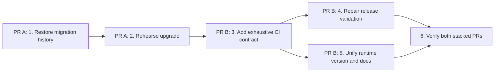

# Workstream 1A execution plan: product release contract

Status: In execution  
Prepared: 2026-07-13  
Planning base: `origin/main` at `8c5d52031f126b4206ba51dd8118d5476b907ab2`  
Roadmap slice: `1A — ci: enforce full pull-request coverage and truthful release contracts`

## Objective

Build the prerequisite migration repair and the product PR-assurance contract as two
stacked, independently reviewable PRs. Together they prove complete database-backed
tests, immutable repository migration history, a rehearsed upgrade from the latest
release, one application version, explicit production configuration, a deterministic
build, and diagnostics against the deployment that was actually created.

This program improves pull-request assurance and the legacy stable-release workflow. It
does **not** claim candidate-first release safety: the current workflow still begins
after publication and aliases production before its smoke test until slice 1B replaces
that choreography.

## Why this slice is first

- Product pull requests currently have no application CI; the only pull-request workflow
  is scoped to the independent marketing site.
- `test:db` names only three files even though nine suites are gated by
  `TEST_DATABASE_URL`, so release checks can silently skip account, query, and row-store
  coverage.
- The stable-release workflow still requires retired `KINSLEUTH_APP_PASSWORD`, uses a
  hard-coded legacy hostname for smoke tests, and starts only after a stable release is
  published.
- Runtime health repeats version `0.17.4` instead of reading `package.json`.
- Most critically, v0.17.4 shipped `001_initial.sql` with SHA-256
  `9023c8a546dcab04a1fb01ae37cd81c2819025e1251a3b9c95df08dea3617c40`, while current
  `main` rewrote the same recorded migration to
  `b64804c4464d8a575e418caa358dc5137011ab9a5df5e17fc962b742f88544d6`.
  A v0.17.4 database skips recorded migration `001_initial`, so it never receives the
  composite archive keys now assumed by row writes.
- Workstreams 2 and 6 depend on this trustworthy baseline. Starting authorization would
  require owner confirmation of role policy; starting storage/container cutover before
  CI would invert the reviewed dependency order.

## Fixed boundaries

Included:

1. Full product CI for every pull request and push to `main`.
2. Exhaustive database-backed Vitest coverage with a fail-fast explicit test-database
   guard and a fixed local CI database.
3. The large GEDCOM regression as an explicit CI job.
4. A prerequisite migration PR restoring released `001_initial.sql`, adding a strict
   forward archive-key migration, preserving legacy user rows, and enforcing repository
   migration-history review.
5. A dedicated v0.17.4-to-current upgrade rehearsal with full data, catalog-equivalence,
   invalid-state, and lock-behavior assertions.
6. A dependent CI/release-contract PR validating release provenance, environment values,
   tag/version, framework, and the emitted deployment URL.
7. Runtime version sourced from `package.json`.
8. Documentation of the commands, contract, exclusions, and follow-up.

Excluded:

- Running migrations against production or changing any Vercel environment value.
- Candidate-first deployment, backup/PITR proof, promotion, stable GitHub Release
  publication, or production rollback choreography; those remain slice 1B.
- Branch-protection policy changes.
- Route authorization, tenant selection, storage cutover, or container hardening.
- Reworking public copy already corrected by the marketing foundation.

## Cross-cutting invariants

1. Never point tests or rehearsals at production data. Database commands require
   `TEST_DATABASE_URL`; fixtures use synthetic data only.
2. Never edit a released migration. Schema changes are forward-only. The checksum
   manifest is an accidental-drift/review gate, not cryptographic proof: protected tags
   and human review remain the historical trust boundary.
3. A failed rehearsal, build, audit, or smoke test fails the release check.
4. Release validation reports missing variable names but never prints secret values.
5. The release workflow continues its current trigger until 1B replaces the choreography;
   1A improves its validation without pretending publication order is safe.
6. Existing persisted identifiers and `KinSleuth` compatibility values remain unchanged.
7. The PR does not deploy, alias, migrate, or otherwise mutate production.

## Dependency graph



PR A is the database rollback domain and must merge first. PR B is based on PR A but
contains only CI, scripts, runtime version, workflow, and documentation changes. Step 4
consumes the canonical commands from step 3. Step 6 is the program merge gate.

## PR A / Step 1 — Restore immutable migration history

### Context brief

`schema_migrations` records versions only. Once `001_initial` is recorded, the runner
skips it forever. Current writes use `ON CONFLICT (archive_id, id)` but the v0.17.4
schema has single-column primary keys. Reapplying an edited `001` is therefore neither
possible nor safe.

### Tasks

1. Restore `db/migrations/001_initial.sql` byte-for-byte from tag `v0.17.4`.
2. Move the idempotent composite primary/foreign-key conversion into new forward
   migration `004_archive_scoped_keys.sql`.
3. Before freezing the still-unreleased authentication migration, replace its destructive
   `DROP TABLE users` with a fail-closed rename to `legacy_users`; preserve any v0.17.4
   rows because they cannot be converted into credential accounts safely.
4. Add a migration checksum manifest that is a bijection over every current `.sql` file.
   Retain the v0.17.4 `001` hash as a hard-coded trust anchor.
5. Add a script that fails on an unlisted, missing, renamed, duplicate-numbered, or
   changed migration. With full history available, compare released files directly to
   the protected release tag as well as the manifest.
6. Do not add database-ledger checksums in this PR. Repository history repair and runtime
   ledger evolution are separate risk domains; the manifest catches accidental drift
   while review/tag protection authorizes intentional forward migrations.

### Verification

```bash
npm run migrations:verify
git show v0.17.4:db/migrations/001_initial.sql | shasum -a 256
shasum -a 256 db/migrations/001_initial.sql
```

The two `001` hashes must match exactly, and the verifier must reject a deliberately
modified temporary copy.

### Exit criteria

- Released migration history is byte-identical to v0.17.4.
- Current schema changes have a new monotonically ordered migration.
- Every current migration is represented exactly once in the review manifest.
- The released `001` bytes match the v0.17.4 tag and cannot drift unnoticed in CI.

### Rollback

Revert the PR before release. Never fix a problem by editing `001` again. If `004`
needs correction after release, add `005`; do not rewrite `004`.

## PR A / Step 2 — Rehearse the v0.17.4 upgrade

### Context brief

A fresh database is insufficient evidence because it never reproduces the released legacy
schema. v0.17.4 executed `001` directly and had no migration ledger, so the regression
must cover both that exact shipped path and an intermediate installation where the current
runner later recorded legacy `001` before this repair landed.

### Tasks

1. Require `TEST_RELEASE_UPGRADE_DATABASE_URL`, reject equality with `TEST_DATABASE_URL`
   or `DATABASE_URL`, and derive isolated fresh/legacy/negative databases from it. A URL
   guard proves shape, separation, and CI locality—not that an arbitrary remote database
   is disposable.
2. Reproduce the v0.17.4 runner exactly by executing the hash-verified tagged `001` bytes
   without a ledger, seed legacy data, and then invoke the current runner. Add a second
   recorded-legacy fixture that executes the same tagged bytes, creates the current ledger,
   records `001_initial`, and proves the current runner safely skips immutable `001` while
   applying the forward repair.
3. Seed synthetic rows in **all fourteen** converted tables: `people`, `person_facts`,
   `import_snapshots`, `raw_records`, `workspace_backups`, `sources`, `research_cases`,
   `hypotheses`, `evidence_items`, `tasks`, `dna_matches`, `dna_hypotheses`, `embeddings`,
   and `ai_runs`. Seed and later verify all five parent-child foreign-key pairs. Seed the
   legacy `users` table and prove its rows survive as `legacy_users`.
4. Seed a second archive with distinct legacy IDs before `004`. After `004`, insert
   duplicate entity IDs across archives and exercise current composite-key upserts.
5. Implement `004` as a strict catalog state machine:
   - accept only exact legacy `PRIMARY KEY (id)` or exact desired
     `PRIMARY KEY (archive_id, id)` definitions;
   - accept only exact legacy single-column cascade FKs or exact named desired composite
     cascade FKs;
   - fail on missing, mixed, reordered, duplicate, or otherwise unexpected definitions;
   - preflight cross-archive and orphan child rows before any constraint mutation;
   - acquire all affected tables in deterministic order, with bounded lock and statement
     timeouts, before changing anything;
   - add composite FKs `NOT VALID`, then validate them explicitly.
6. Run current pending migrations and assert `002`, `003`, and `004` are applied once.
   Run `004` directly against both legacy and already-desired schemas to prove
   legacy-to-desired and desired-to-no-op behavior.
7. Compare normalized catalogs between separately migrated fresh and upgraded databases:
   tables, columns/types/nullability/defaults, PK/FK/unique/check definitions and names,
   indexes, extension placement, RLS flags, grants/default privileges, and the migration
   ledger shape. Exclude only expected ledger row data.
8. Add negative rehearsals for cross-archive children and unexpected/partial constraints;
   assert the migration and ledger transaction roll back unchanged.
9. Add a concurrent reader/writer lock rehearsal. Document `004` as a blocking
   maintenance-window migration for slice 1B; do not claim zero downtime.
10. Run migrations a second time and assert no schema or ledger change.

### Verification

```bash
TEST_RELEASE_UPGRADE_DATABASE_URL=postgres://... npm run test:release-upgrade
```

### Exit criteria

- The latest released schema upgrades without data loss.
- Composite keys and foreign keys match current write assumptions on every affected
  table and relationship.
- Fresh and upgraded schema catalogs are equivalent.
- Unexpected or cross-archive legacy state fails before mutation.
- The rehearsal is deterministic and idempotent.

### Rollback

The test and `004` are additive in the branch. If rehearsal fails, stop the release work
and correct the forward migration; do not weaken assertions or mutate the legacy fixture.

## PR B / Step 3 — Add the exhaustive product CI contract

### Context brief

Database suites currently opt out when `TEST_DATABASE_URL` is absent. The CI command
must fail before Vitest if the explicit test database is missing, then run every test file
instead of a hand-maintained allowlist.

### Tasks

1. Add a small database-URL guard with tests for absent, invalid, and accepted PostgreSQL
   URLs plus equality with `DATABASE_URL`. It must not print credentials or promise that
   a syntactically valid remote URL is disposable.
2. Normalize package scripts:
   - keep the default fast local test;
   - make the exhaustive DB command run all Vitest files;
   - keep upgrade rehearsal and large GEDCOM commands explicit.
3. Add `.github/workflows/ci.yml` for all pull requests and pushes to `main`, with
   read-only contents permission, concurrency cancellation, Node 22, `npm ci`, and a
   version-pinned pgvector/Postgres 16 service.
4. Run lint, typecheck, complete DB-backed tests, production build, migration history,
   upgrade rehearsal, large GEDCOM regression, and high-severity production audit.
5. Keep job names stable and add a final required gate with `if: always()` that succeeds
   only when every `needs.*.result` is exactly `success`. Use no path filters,
   `continue-on-error`, or conditional test bypasses. Pin the pgvector image by immutable
   digest.
6. Add a repository contract test that prevents regression to partial DB file lists,
   retired secrets, or the legacy smoke hostname.

### Verification

```bash
npm test
npm run test:db
TEST_DATABASE_URL=postgres://... npm run test:db
TEST_DATABASE_URL=postgres://... npm run test:db:large
npm audit --omit=dev --audit-level=high
```

The unconfigured database command must fail. Both configured commands must pass.

### Exit criteria

- Every product PR receives one stable release-contract status.
- No DB-gated suite can be skipped silently in CI.
- Large-import and upgrade failures are independently visible.

### Rollback

CI can be reverted if it has a false positive, but retain the complete test command,
migration integrity verifier, and removal of retired release configuration.

## PR B / Step 4 — Repair release validation without changing choreography

### Context brief

The release workflow currently validates a retired password and smoke-tests an old
hostname instead of the deployment it just created. Vercel CLI stdout is the canonical
deployment URL. Environment validation must check configuration without logging values.

### Tasks

1. Check out full history and add a testable release-contract script that validates:
   - the release tag equals `package.json` version;
   - the tagged commit is an ancestor of `origin/main`;
   - the linked project framework is Next.js;
   - production has `DATABASE_URL`, `DATABASE_POOL_MAX`,
     `DATABASE_AUTO_MIGRATE`, `AUTH_SECRET`, `APP_BASE_URL`,
     `BLOB_READ_WRITE_TOKEN`, and `CRON_SECRET`;
   - the expected pulled production environment file exists and parses successfully;
   - `DATABASE_AUTO_MIGRATE` is exactly false, `APP_BASE_URL` is an HTTPS URL, numeric
     database settings are valid, and required secrets are nonempty/non-placeholder.
   Metadata-only validation must not satisfy value checks.
2. Remove `KINSLEUTH_APP_PASSWORD` from the release contract.
3. Use `VERCEL_TOKEN` from the environment rather than repeating it in command-line
   flags.
4. Reuse the canonical test/migration-integrity commands from CI.
5. Capture deploy stdout and smoke-test `${{ steps.deploy.outputs.url }}`.
6. Keep the stable-release trigger unchanged and document that candidate-first
   migration/promotion remains 1B.

### Verification

- Unit fixtures cover missing variables, wrong target, wrong framework, tag mismatch,
  invalid URL, and a valid contract without exposing values.
- Workflow lint/parse succeeds.
- No `KINSLEUTH_APP_PASSWORD` or hard-coded `kinsleuth.vercel.app` remains in release
  workflow code.

### Exit criteria

- A release fails before build when configuration/version identity is incomplete.
- Smoke checks target the emitted deployment URL.
- No production action is performed while developing or testing this PR.

### Rollback

Revert workflow code if validation is wrong, while keeping retired-secret removal and
deployment-output smoke targeting. Do not publish a test release to validate 1A.

## PR B / Step 5 — Unify runtime version and document the contract

### Context brief

Health reports must identify the package being built. Documentation must describe the
new exhaustive commands and be explicit that 1B and production migration remain open.

### Tasks

1. Add a server-safe application-version module sourced from `package.json`.
2. Replace all runtime `0.17.4` literals and assert health version equals the package.
3. Update README and CONTRIBUTING development/CI/release instructions.
4. Update roadmap status and planning base without claiming Gate B or release safety
   beyond what this PR proves.
5. Record that current product Vercel configuration lacks `APP_BASE_URL`; the workflow
   will intentionally fail a future release until the canonical product URL is configured.

### Verification

```bash
npm run lint
npm run typecheck
npm test
npm run build
```

### Exit criteria

- Package version is the only application-version source.
- A maintainer can reproduce every CI command from documentation.
- Remaining owner/provider work is explicit and non-blocking for this PR.

### Rollback

Runtime version can fall back to build-time injection if JSON import proves incompatible,
but never return to duplicated literals.

## Step 6 — Stacked merge gate and handoff

### Tasks

1. Run PR A's migration checks against dedicated fresh/legacy/negative databases.
2. Run PR B's full standard contract against a separate disposable pgvector/Postgres
   database.
3. Run an adversarial review covering migration correctness, workflow truthfulness,
   secret handling, false-green paths, and scope creep.
4. Resolve all concrete findings, rerun affected checks, and inspect the final diff.
5. Commit each rollback domain with DCO sign-off, push two branches, open two stacked
   draft PRs, and monitor every check. PR A targets `main`; PR B targets PR A's branch
   until PR A merges, then is retargeted to `main` and revalidated.

### Required evidence

```bash
npm ci
npm run lint
npm run typecheck
npm test
TEST_DATABASE_URL=postgres://... npm run test:db
TEST_DATABASE_URL=postgres://... npm run test:db:large
TEST_RELEASE_UPGRADE_DATABASE_URL=postgres://... npm run test:release-upgrade
npm run migrations:verify
npm run build
npm audit --omit=dev --audit-level=high
DATABASE_URL=postgres://fresh... npm run db:migrate
DATABASE_URL=postgres://fresh... npm run db:migrate
```

### Exit criteria

- Local checks and GitHub CI pass from a clean checkout.
- The PRs contain no production secrets, generated databases, build output, or provider
  state changes.
- Review can approve or revert migration behavior independently from workflow behavior.

## Plan mutation protocol

- **Split** has been exercised: migration repair is PR A; CI/release validation is
  dependent PR B. Split further only if either rollback domain becomes unsafe to review.
- **Insert** a step only for a discovered release blocker with current-head evidence.
- **Defer** owner settings, provider backup/PITR, branch protection, or authorization
  policy rather than guessing.
- **Abandon** the slice if a safe v0.17.4 upgrade cannot be proven; do not ship a partial
  CI facade that leaves the migration defect hidden.
- Record material mutations in this file with the reason and updated dependency edges.

## Adversarial review gate

Completed before implementation. Two independent reviews rejected the first one-PR
draft. The plan was revised to resolve these material findings:

1. Split database migration behavior from CI/Vercel workflow behavior.
2. Narrow claims to PR assurance and legacy release diagnostics until 1B.
3. Preserve the v0.17.4 `users` table instead of dropping possible data.
4. Seed all fourteen converted tables and all five FK relationships.
5. Make `004` a fail-closed catalog state machine with preflight integrity checks.
6. Use isolated upgrade databases and compare fresh/upgraded catalogs.
7. Treat the migration as blocking, bound lock behavior, and rehearse contention.
8. Keep checksum enforcement in repository review rather than expanding the DB ledger.
9. Require full git provenance and fail-closed pulled Vercel value validation.
10. Specify immutable service pinning and an `always()` aggregate CI gate.

The final implementation review must still specifically challenge:

- whether restoring `001` plus `004` reaches the same schema on fresh and upgraded DBs;
- whether constraint replacement preserves data and relationships;
- whether any CI path can pass while DB suites are skipped;
- whether release validation exposes values or trusts request-controlled input;
- whether a workflow change accidentally deploys or migrates production;
- whether the PR crosses into 1B, authorization policy, or storage/container work.
